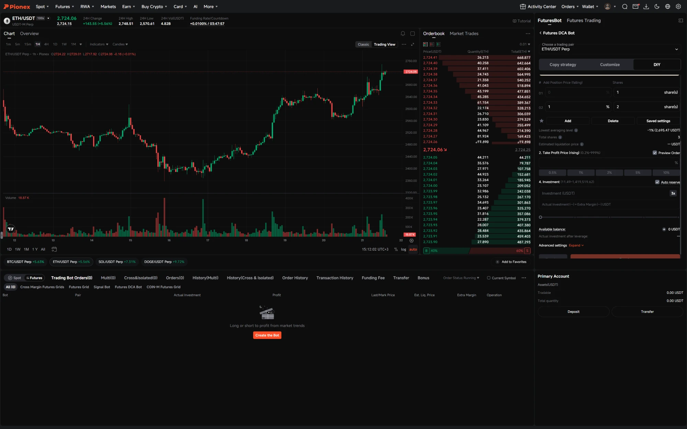
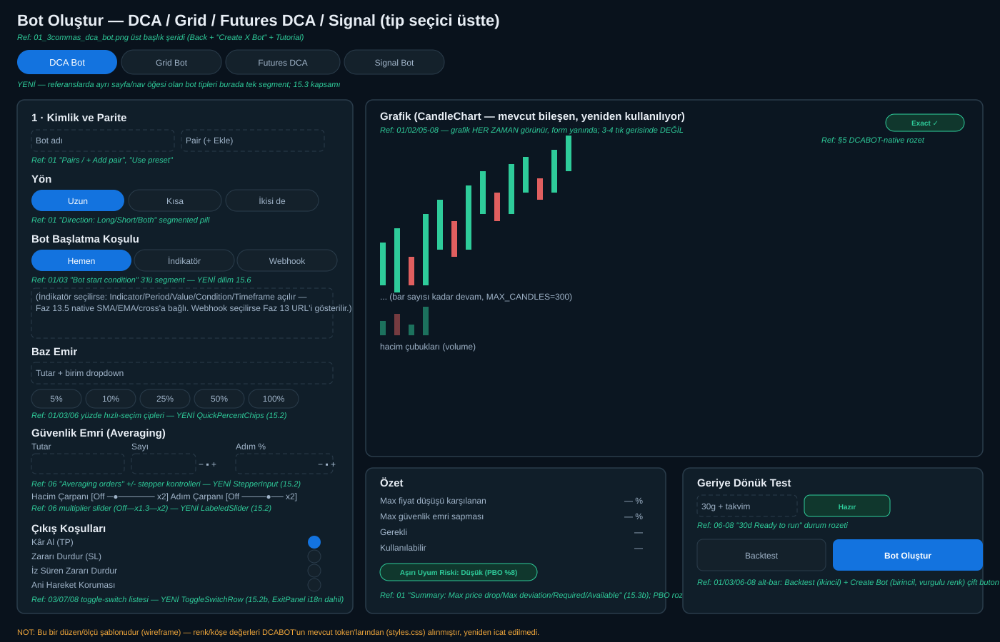
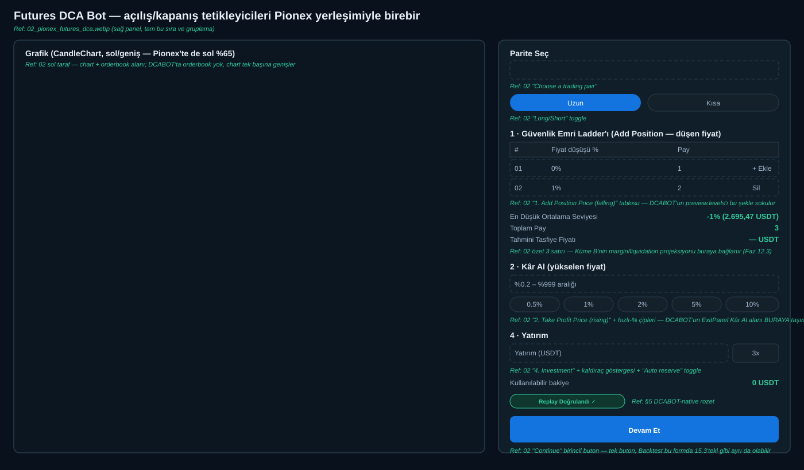
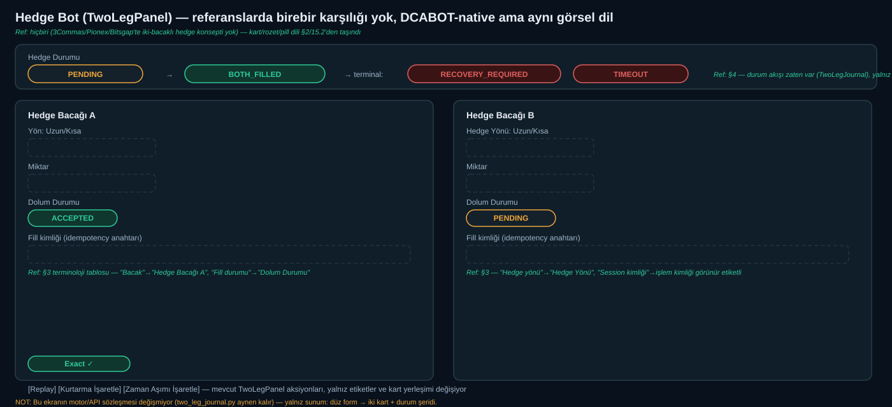

# Faz 15 — Görsel Düzeltme: Neden Faz 12 Referans Ekranlara Benzemedi

**Tarih:** 2026-09-21 · Bu belge, "diğer ajan (muse) Faz 12-14'ü bitirdi ama sonuç senin gönderdiğin 3Commas/Pionex/Bitsgap ekranlarıyla hiç ilgisi yok" şikayetinin **canlı ortamda doğrulanmış** kök nedenini ve düzeltme planını içerir.

**Dış ajana (muse) not:** Bu belgedeki her `Ref: NN` referansı, `docs/referans_ekranlar/` klasöründeki gerçek ekran görüntüsüne işaret eder — tahmin etme, dosyayı aç ve bak. `docs/wireframes/` klasöründeki 3 SVG, yeni ekranların **ölçülü düzen şablonudur** — piksel-birebir değil ama bölge oranları (form ~%35 / grafik ~%65 gibi) ve eleman sırası bağlayıcıdır.

---

## Yönerge — wireframe'ler taslaktır, kör kopyalama yok

Bu belgedeki 3 SVG (`docs/wireframes/`) **Claude'un hızlı çizdiği kaba bir ölçü şablonudur, nihai tasarım değildir** — bağlayıcı olan yalnız: (a) bölge oranları (form ~%35/grafik ~%65 gibi), (b) eleman **sırası** (hangi alan hangisinden önce gelir), (c) hangi referans görselden hangi elemanın alındığı. Piksel ölçüleri, renk tonları, tipografi detayları, köşe yarıçapı gibi ince ayarlar SVG'de gösterildiği gibi **birebir kopyalanmayacak**.

**Beklenen çalışma biçimi:**
1. Önce `docs/referans_ekranlar/`'daki 8 gerçek ekran görüntüsünü aç ve incele — **asıl doğruluk kaynağı bunlardır**, SVG değil.
2. Kendi tasarım/UX araştırmanı yap: bu görsellerdeki spacing, tipografi ölçeği, gölge/elevasyon, hover/focus durumları, mikro-etkileşimler (örn. slider sürüklemesi, toggle animasyonu) için ek kaynak tara (Dribbble/Figma community/gerçek 3Commas-Pionex-Bitsgap canlı sitelerinin kendisi erişilebiliyorsa) ve DCABOT'un mevcut token sistemine (`styles.css`, `:root[data-theme="dark"]`) uyacak şekilde **kendi kararını ver**.
3. SVG'lerde eksik/tutarsız/yanlış gördüğün her şeyi düzelt — bunlar seni sınırlamak için değil, hangi bölgenin nereye gideceğini kaybetmemen için var.
4. Her tasarım kararını (SVG'den saptığın yerler dahil) `evidence/F15.X/SONUC.md`'ye 1-2 cümleyle gerekçelendir — bu, 15.4'ün zorunlu ekran-görüntüsü kanıtı kuralının bir parçasıdır.

**Kısacası:** referans görseller = kanun, SVG'ler = kaba taslak/hafıza yardımcısı, sonuç = ikisinden daha iyi olmalı.

---

## 0. Referans görseller ve wireframe'ler (dosyalar, tek tek atıflı)

| Dosya | İçerik | Bu belgede nerede kullanıldı |
|---|---|---|
| `referans_ekranlar/01_3commas_dca_bot.png` | 3Commas "Create DCA Bot" — Direction segment, Bot start condition+indikatör formu, Amount+% çipleri, DCA Mode, Averaging method, Summary kartı, Backtest+Create Bot | §3 madde 4/5/6/7/8/9/10, §4, §7 madde 1-10 |
| `referans_ekranlar/02_pionex_futures_dca.webp` | Pionex "Futures DCA Bot" — Add Position ladder, En Düşük Ortalama/Toplam Pay/Tasfiye özeti, Take Profit+% çipleri, Investment+kaldıraç | §4 (tam), §7 madde 10 |
| `referans_ekranlar/03_3commas_grid_bot.webp` | 3Commas "Create Grid Bot" — Grid type (Long/Neutral/Short/Hedge), Grid size, Lower/Higher price, Profit per Grid+Optimize, Exit toggle listesi (7 madde) | §7 madde 11-14 |
| `referans_ekranlar/04_3commas_signal_bot.webp` | 3Commas "Create signal bot" modalı — 3 adım stepper, TradingView Indicator, Exchange accounts toggle'ları, Order type, Multiple entries/Swing trade/DCA Trading, Exits | §7 madde 15-19 |
| `referans_ekranlar/05_bitsgap_dca_strategies.webp` | Bitsgap ana ekran — chart+aktif bot tabları+boş durum, Strategies sekme satırı (DCA/GRID/BTD/DCA Futures/LOOP/COMBO), Available pairs listesi | §7 madde 20-21 |
| `referans_ekranlar/06_bitsgap_dca_averaging.webp` | Bitsgap DCA formu, "Averaging orders" açık — stepper kontroller, Amount/Step multiplier slider | §7 madde 22-24 |
| `referans_ekranlar/07_bitsgap_dca_tpsl.webp` | Bitsgap DCA formu, "Position TP & SL" açık — Regular/Trailing, Percentage of, PNL tahmini | §7 madde 25 |
| `referans_ekranlar/08_bitsgap_dca_risk.webp` | Bitsgap DCA formu, "Risk management" açık — Pump/Dump, Target profit, Allowed loss, Max/Min price, Reinvest | §7 madde 26 |
| `wireframes/15_3_bot_olustur.svg` | **YENİ** — birleşik "Bot Oluştur" ekranının ölçülü düzeni (form ~%35 sol / grafik ~%65 sağ + özet/backtest alt) | §2 (15.1-15.3), §4 |
| `wireframes/15_3b_futures_dca.svg` | **YENİ** — Futures DCA formunun Pionex sırasına göre yeniden düzenlenmiş hali | §4, §6 (15.3b) |
| `wireframes/15_3c_hedge_bot.svg` | **YENİ** — Hedge Bot (TwoLegPanel) için Leg A/Leg B kart + durum şeridi tasarımı (referans yok, DCABOT-native) | §4, §6 (15.3c) |

---

## 1. Doğrulama — ne çalışıyor, ne çalışmıyor

Backend'i (`:8000`) ve frontend'i (`:5173`) yeniden başlatıp gerçek ekranı inceledim (önce eski sekmede bozuk bir görüntüyle karşılaştım — muse'ın `styles.css`'i defalarca HMR ile güncellemesi tarayıcı sekmesinde bozuk bir CSS önbelleği bırakmış; **disk üzerindeki dosya temizdi**, sunucuyu tazeleyince gerçek durum ortaya çıktı — bu karışıklığı netleştirmek için not düşüyorum).

**Gerçek durum, temiz yeniden başlatma sonrası:**
- ✅ Koyu tema token mimarisi (`:root[data-theme="dark"]`) gerçekten çalışıyor — lacivert arkaplan, mavi accent, kart tabanlı paneller, yuvarlatılmış köşeler. Faz 11'in token altyapısı boşa gitmemiş.
- ✅ Bazı yerlerde (Piyasa & Veri → Venue Order Types) pill/badge tarzı etiketler zaten var.
- ✅ `CandleChart.tsx` gerçek, doğru inşa edilmiş bir mum+hacim grafiği (BigInt exact-scale, marker desteği) — kod kalitesi iyi.
- ✅ Checker 1414/1414, vitest 171/171, tüm gate'ler PASS — **ama bu testler hiçbir zaman görsel benzerliği ölçmüyor.**

**Gerçek, doğrulanmış görsel/akış boşlukları:**
1. **Grafik hiçbir yerde "hero" (ana, göz alıcı) eleman değil.** Üç referansında da (3Commas/Pionex/Bitsgap) mum grafiği ekranın %60-70'ini kaplayan, HER ZAMAN görünen bir öğe. DCABOT'ta `CandleChart` yalnız Dataset→Preflight→Run Plan→Simulate zincirinin sonunda, 3-4 tıklama sonra beliriyor; "Botlar & Stratejiler" ana sayfasında (bot kurulurken) hiç yok, "Piyasa & Veri"de de varsayılan görünümde yok.
2. **Sayfa düzeni "tek amaç = tek ekran" değil, "her şey üst üste" yığın.** "Botlar & Stratejiler" sekmesi tek sayfada: Bot stüdyosu + Ladder + Ekonomik özet + (katlanır) 11 araştırma aracı + Bot Oluştur sihirbazı + Bot Fleet + Deal Desk + Exit Desk + Scheduler + Risk Desk — hepsi alt alta. Referanslarda "Create DCA Bot" kendi başına, dolu ekranlık, odaklı bir görünüm.
3. **Form kontrolleri sektör-standardı değil, düz HTML formu.** Referanslarda: segmented pill butonlar (Long/Short/Both, Grid Type), yüzde hızlı-seçim çipleri (5%/10%/25%/50%/100%), toggle-switch listesi (Exit seçenekleri). DCABOT'ta: hepsi düz `<select>`/`<input>` — "Bot Başlatma Koşulu" bile stilsiz bir dropdown. Renk/kart mimarisi doğru olsa da, kontrol tipografisi bir yönetici paneli gibi duruyor, tüketici ürünü gibi değil.
4. **Süreç hatası (asıl kök neden):** Faz 12'nin kapanış kriteri yalnız `checker PASS` + `vitest PASS` + `phase_gate.py GATE PASS` idi — bunların hiçbiri "referans ekrana benziyor mu" sorusunu sormuyor. Muse (ve benim yazdığım Faz 12 planı) işi **mimari/veri** problemi olarak ele aldı (grafik verisi var mı, terminoloji doğru mu, akış birleşti mi) ve bunu doğru yaptı — ama hiç kimse (ben dahil, plan yazarken) gerçek bir ekran görüntüsünü referanslarla yan yana koyup bakmadı. Bu yüzden sapma 3 fazlık çalışmanın sonuna kadar fark edilmedi.

---

## 2. Faz 15 — Düzeltme planı

**Yeni kural (süreç düzeltmesi, en önemli madde):** Bundan sonra her UI-dokunan dilim, `checker`/`vitest` PASS'ine ek olarak **gerçek bir ekran görüntüsünü referansla yan yana koyan bir görsel kabul adımı** olmadan kapanamaz. Bu, `evidence/F15.*/SONUC.md`'ye eklenecek bir zorunlu alan olacak.

### 15.1 — Grafiği hero elemana taşı
- "Botlar & Stratejiler" sekmesinin **en üstüne**, bot kurulum formunun yanına (referanslardaki gibi form solda ~%35, grafik sağda ~%65) `CandleChart` yerleştirilir — seçili sembol/dataset'in (veya paper trading aktifse canlı print akışının) verisiyle, Preflight/Simulate zincirini beklemeden.
- "Piyasa & Veri"ye de aynı grafik, seçili public snapshot'la.
- Backend'de zaten var olan `chart-data` sözleşmesi + `CandleChart` bileşeni **yeniden kullanılır** — yeni veri modeli gerekmiyor, yalnız yerleşim.

### 15.2 — Sektör-standardı form kontrolleri (yeni paylaşımlı bileşenler)
- `SegmentedControl` (pill grup — Long/Short/Both, Grid Type Long/Neutral/Short/Hedge).
- `QuickPercentChips` (5/10/25/50/100% hızlı seçim).
- `ToggleSwitchRow` (Exit seçenekleri: Take Profit/Stop Loss/Trailing Stop/Pump Protection — liste halinde açma/kapama anahtarı).
- Mevcut `forms.tsx` ailesine eklenir (yeni bir paralel sistem değil); `BotWizard`/`FuturesPanel`/`ExitPanel` bu bileşenleri kullanacak şekilde güncellenir. Terminoloji (Faz 12'de eklenen i18n anahtarları) aynen korunur — yalnız görsel kontrol tipi değişir.

### 15.3 — Tek-amaç "Bot Oluştur" ekranı
- "Botlar & Stratejiler" sayfasından "+ Yeni Bot" aksiyonu, o anki gibi sayfanın ortasında değil, **kendi tam-yükseklik görünümüne** geçer (grafik sağda, sihirbaz solda) — referanslardaki "Create Bot" modalı/sayfası deneyimi.
- 11 araştırma aracı (Templates/Signal/Futures/TwoLeg/Rebalance/Risk/vb.) zaten "Gelişmiş Araçlar" başlığı altında toplanmıştı (Faz 12.2) — bu artık yalnız organizasyonel değil, **varsayılan tamamen kapalı ve görsel olarak geri planda** olacak (küçük, gri, ayrı bir "Araştırma" alt-sekmesi gibi).

### 15.4 — Görsel kabul kanıtı (süreç)
- Her alt-dilim kapanışında `evidence/F15.X/SONUC.md`'ye: (a) referans ekran görüntüsünün dosya adı, (b) yeni DCABOT ekranının gerçek bir ekran görüntüsü, (c) hangi noktaların hâlâ farklı olduğuna dair 1-2 cümlelik dürüst not eklenir. Bu, checker/vitest'in yakalayamadığı boşluğu kapatır.

**Sıra:** 15.1 (grafik hero) → 15.2 (form kontrolleri) → 15.3 (tek-amaç ekran) → 15.4 zaten her dilimde paralel uygulanır (ayrı bir dilim değil, kural).

**Kapsam dışı bırakılan (bilinçli):** Faz 12/13/14'ün **backend/veri** işi (chart-data sözleşmesi, i18n XML, webhook, CPCV/PBO/DSR) sağlam ve yeniden yazılmayacak — yalnız *sunum katmanı* değişiyor. Bu nedenle Faz 15, Faz 12'yi iptal etmiyor, üstüne inşa ediyor.

---

## 3. "Biz neyi bekliyorduk, ne oldu" — terminoloji için kesin kanıt

Faz 12.5'in i18n çalışmasını dosya dosya denetledim. Sonuç: **iş yarım kaldı, tamamlanmadı sanıldı** — çünkü kapanış ölçütü ("kaç `t()` çağrısı eklendi") yanlış proxy'ydi; doğru ölçüt "hangi ekranlar hâlâ ham terim kullanıyor" olmalıydı.

| Panel | i18n durumu | Kanıt |
|---|---|---|
| App.tsx Bot stüdyosu | ✅ Tam — Baz Emir/Güvenlik Emri/Fiyat Sapması doğru | `t("dca.baseOrder.label")` vb. |
| BotWizard.tsx | ✅ Tam — Kâr Al/Zararı Durdur/İz Süren doğru | `t("exit.takeProfit.label")` vb. |
| FuturesPanel.tsx | ⚠️ Kısmi — terim doğru ama kontrol hâlâ düz `<select>` | `t("grid.type.label")` var ama `<select>` |
| **ExitPanel.tsx** | ❌ **Sıfır** — hâlâ "Yön"/"Stop fiyatı"/"Açık miktar"/"Aktivasyon"/"Oran" | `grep t\(" → 0 sonuç` |
| **TwoLegPanel.tsx** (gerçek Hedge Bot ekranı) | ❌ **Sıfır** — hâlâ "Session kimliği"/"Bacak"/"Hedge yönü"/"Fill durumu" | `grep t\(" → 0 sonuç` |

**Bu, tam olarak şikayetinin kaynağı.** BotWizard ve ana form terminolojisi düzelmişti ama **asıl Futures/Hedge açılış-kapanış tetikleyicilerinin yaşadığı iki ekran (ExitPanel = TP/SL/Trailing, TwoLegPanel = Hedge) Faz 12'de hiç dokunulmamış** — mühendislik disiplini "kaç yeni i18n anahtarı eklendi"yi ölçtü, "hangi ekranlar hâlâ eski" diye sormadı.

### 3.1 Tam terminoloji sözlüğü (referans görsellerinden, tek kaynak)

Üç platform aynı kavrama farklı isim veriyor — DCABOT için **3Commas'ın adını birincil** alıyorum (sektörde en yaygın/tanınan DCA terminolojisi), diğerleri dipnot:

| Kavram | Birincil terim (TR) | EN | Not (platform farkı) |
|---|---|---|---|
| İlk emir | **Baz Emir** | Base Order | Bitsgap: "Base order amount" |
| DCA ek kademe | **Güvenlik Emri** | Safety Order | Bitsgap: "Averaging order"; Pionex: "Add Position" |
| Ek kademe miktarı | **Güvenlik Emri Tutarı** | Safety Order Amount | — |
| Ek kademe sayısı | **Güvenlik Emri Sayısı** | Safety Order Count | Bitsgap: "Averaging orders quantity" |
| Fiyat eşiği | **Fiyat Sapması %** | Price Deviation % | — |
| Miktar çarpanı | **Hacim Çarpanı** | Volume Multiplier | Bitsgap: "Amount multiplier" |
| Adım çarpanı | **Adım Çarpanı** | Step Multiplier | — |
| Kâr al | **Kâr Al (TP)** | Take Profit (TP) | — |
| Zarar durdur | **Zararı Durdur (SL)** | Stop Loss (SL) | — |
| İz süren zarar durdur | **İz Süren Zararı Durdur** | Trailing Stop | — |
| Zararı başabaşa çek | **Başabaşa Çek** | Move Stop Loss to Breakeven | 3Commas Signal Bot terimi |
| Yön (long pozisyon vb.) | **Yön: Uzun/Kısa** | Direction: Long/Short | ExitPanel'in "Yön"ü buraya haritalanır |
| Açık pozisyon miktarı | **Açık Pozisyon** | Open Position Size | ExitPanel'in "Açık miktar"ı |
| İz süren aktivasyon eşiği | **Aktivasyon Fiyatı** | Activation Price | ExitPanel'in "Aktivasyon"u |
| İz süren oran | **İz Sürme Oranı %** | Trailing Rate % | ExitPanel'in "Oran"ı |
| **Hedge bacağı A/B** | **Hedge Bacağı A / Hedge Bacağı B** | Hedge Leg A / Leg B | TwoLegPanel'in "Bacak"ı — referanslarda net karşılığı yok, DCABOT-native (bkz. §4) |
| Hedge yönü | **Hedge Yönü: Uzun/Kısa** | Hedge Direction | TwoLegPanel'in "Hedge yönü"ü |
| Dolum durumu | **Dolum Durumu** | Fill Status | TwoLegPanel'in "Fill durumu"u |
| Kurtarma gerekli | **Kurtarma Gerekli** | Recovery Required | TwoLegPanel'in terminal durumu |
| Zaman aşımı | **Zaman Aşımı** | Timeout | TwoLegPanel'in terminal durumu |
| Ani hareket koruması | **Ani Hareket Koruması** | Pump/Dump Protection | — |
| Aktif emir limiti | **Aktif Emir Limiti** | Active Orders Limit | Bitsgap terimi |
| Toplam hedef kâr/zarar | **Hedef Toplam Kâr / İzin Verilen Toplam Zarar** | Target Total Profit / Allowed Total Loss | — |
| Bakiye kullanımı | **Kullanılabilir Bakiye** | Available for Bot Use | Bitsgap sağ panel |
| Tahmini tasfiye fiyatı | **Tahmini Tasfiye Fiyatı** | Estimated Liquidation Price | Pionex Futures DCA terimi |
| En düşük ortalama seviyesi | **En Düşük Ortalama Seviyesi** | Lowest Averaging Level | Pionex Futures DCA terimi |

---

## 4. Futures Bot / Hedge Bot — açılış-kapanış tetikleyicileri, referanslardaki yerleşim

*Yukarı: `02_pionex_futures_dca.webp` — bu bölümün tamamı bu görüntüden çıkarıldı.*

**Pionex Futures DCA Bot ekranının tam yapısı** (referans görselinden): sol büyük grafik → sağda tek panel: Exchange+Pair seçimi → Strateji sekmesi (Copy strategy/Customize/**DIY**) → **Long/Short** toggle → "1. Add Position Price (falling)" tablosu (satır: %düşüş + pay sayısı, +Add/Delete) → **En Düşük Ortalama Seviyesi** / **Toplam Pay** / **Tahmini Tasfiye Fiyatı** özet satırları → "2. Take Profit Price (rising)" (%yükseliş + hızlı-% çipleri 0.5/1/2/5/10%) → "4. Investment" (USDT tutarı + kaldıraç + Auto reserve toggle) → alt: Kullanılabilir bakiye → **Continue**.

**DCABOT'un bu yapıyla eşleşmesi gereken karşılığı:**
- "Add Position Price (falling)" tablosu = DCABOT'un **Güvenlik Emri ladder'ı** (`preview.levels` zaten var, tam bu şekle sokulabilir — seviye/fiyat-düşüş-%/pay).
- "En Düşük Ortalama Seviyesi/Toplam Pay/Tahmini Tasfiye Fiyatı" = DCABOT'un `Ladder planı` + `Ekonomik özet` kartlarının **birleşimi**, ama şu an ayrı kartlarda; Pionex'te tek özet satırı.
- "Take Profit Price (rising)" + hızlı-% çipleri = **ExitPanel'in Kâr Al alanı**, ama şu an ayrı bir "Exit Desk" panelinde, Futures/DCA formunun içinde değil.
- "Investment" + kaldıraç + Auto reserve = **Bütçe** (BotWizard'da var) + `futures_grid_margin`'in (Faz 12.3'te bağlanan Küme B) sağladığı kaldıraç/marj verisi — bugün ayrı ayrı yerlerde.

**Hedge Bot (TwoLegPanel) için referanslarda birebir karşılık yok** — 3Commas/Pionex/Bitsgap'in hiçbiri "iki bacaklı hedge" konseptini böyle sunmuyor (en yakını 3Commas'ın "Both" yön seçeneği, tek bacaklı). Bu, **DCABOT'un referanslarda olmayan bir özelliği** (bkz. §5) — dolayısıyla birebir kopyalamak yerine, aynı görsel dilde (kart, pill, chip) yeni ama tutarlı bir ekran tasarlanmalı: Leg A/Leg B yan yana iki kart (her biri kendi Yön/Miktar/Durum rozetiyle), ortada bağlayıcı bir "Hedge Durumu" şeridi (PENDING → BOTH_FILLED / RECOVERY_REQUIRED / TIMEOUT, renk kodlu rozet).

**Açılış/kapanış tetikleyicileri ekrandaki yeri (yeni kural):** Her bot tipinde (DCA/Grid/Futures DCA/Hedge) açılış koşulu (Bot Başlatma Koşulu: Hemen/İndikatör/Webhook) formun **en üstünde**, kapanış koşulları (TP/SL/Trailing/Breakeven) formun **hemen altında, ayrı bir "Çıkış Koşulları" bölüm başlığıyla** — referanslardaki gibi tek ekranda, ayrı "Exit Desk" sekmesine gitmeden. Bu, §2'nin 15.3 maddesini (tek-amaç Bot Oluştur ekranı) somutlaştırıyor.

**Wireframe'ler (ölçülü düzen şablonu, muse bunları birebir izlemeli):**

*`wireframes/15_3_bot_olustur.svg` — 15.1/15.2/15.3'ün birleşik hali: form ~%35 sol, grafik ~%65 sağ, her eleman referans dosya+satır numarasıyla etiketli.*

*`wireframes/15_3b_futures_dca.svg` — 15.3b: Pionex'in tam sırası (ladder → özet → TP → Investment).*

*`wireframes/15_3c_hedge_bot.svg` — 15.3c: referans yok, DCABOT-native ama aynı görsel dil (kart/pill/rozet).*

---

## 5. DCABOT'ta olup referanslarda olmayan özellikler — nereye yerleştirilmeli

Referans ürünlerin **hiçbirinde** olmayan ama DCABOT'un sahip olduğu, gerçek katma değer taşıyan özellikler var. Bunları ayrı bir "araştırma sekmesi"ne gömmek yerine, **aynı görsel dilde, ilgili ekranın içine küçük rozet/kart olarak** yerleştiriyoruz — referans ürünlerin kullanıcısı bunu "ekstra karmaşıklık" değil "güven sinyali" olarak okur:

| DCABOT özelliği | Referanslarda var mı | Nereye yerleşmeli |
|---|---|---|
| Exact Fraction/Decimal hesap (yuvarlama sapması yok) | ❌ Yok (hepsi float kullanır) | Ekonomik özet kartının köşesinde küçük "Exact ✓" rozeti (tooltip: "Kesirli aritmetik, yuvarlama kaybı yok") |
| Idempotent replay (aynı olay iki kez işlenmez) | ❌ Yok | Bot durum satırında "Replay Doğrulandı ✓" rozeti |
| Fail-closed / UNKNOWN durumu açık gösterimi | ❌ Yok (susarlar) | Durum rozeti olarak: normal yeşil/kırmızı yanında sarı "UNKNOWN — inceleniyor" |
| PBO/Deflated Sharpe overfitting skoru (Faz 14) | ❌ Yok (backtest sonucu tek P&L sayısı) | Backtest sonuç kartının içine ek satır: **"Aşırı Uyum Riski: Düşük (PBO %8)"** — 3Commas/Bitsgap'in backtest ekranına hiç sahip olmadığı bir güven katmanı |
| Mutation gate / mainnet kilidi görünürlüğü | ❌ Yok | Ayarlar'da zaten var, formda tekrar etmeye gerek yok |
| Canary politikası (kayıp/pencere sınırı) | ❌ Yok | Risk Management bölümünde Bitsgap'in "Allowed total loss" toggle'ının yanına "Canary: aktif/pasif" rozeti |

**İlke:** Referans ürünler nereye bir toggle/rozet koyuyorsa, DCABOT'un ekstra güvencesi **aynı bölümün içine, aynı görsel ağırlıkta bir toggle/rozet olarak** eklenir — yeni bir sekme, yeni bir "araştırma paneli" açılmaz.

---

## 6. Faz 15 — genişletilmiş dilim listesi (güncel)

1. **15.1** Grafiği hero elemana taşı (§2).
2. **15.2** Sektör-standardı form kontrolleri: `SegmentedControl`/`QuickPercentChips`/`ToggleSwitchRow` (§2).
3. **15.2b — YENİ:** `ExitPanel.tsx` ve `TwoLegPanel.tsx`'e i18n uygulanır (§3 tablosu) — Faz 12.5'in atladığı iki ekran.
4. **15.3** Tek-amaç "Bot Oluştur" ekranı; her bot tipinde açılış koşulu üstte, çıkış koşulları hemen altta (§4).
5. **15.3b — YENİ:** Futures DCA formu Pionex yerleşimine göre yeniden düzenlenir: ladder tablosu → özet satırı (En Düşük Ortalama/Toplam Pay/Tahmini Tasfiye) → TP satırı+hızlı-% çipleri → Investment+kaldıraç (§4).
6. **15.3c — YENİ:** Hedge Bot (TwoLegPanel) için Leg A/Leg B kart + durum şeridi tasarımı (§4, referans yok — DCABOT-native ama tutarlı görsel dilde).
7. **15.5 — YENİ:** DCABOT-native özellik rozetleri (§5 tablosu) ilgili kartlara eklenir.
8. **15.4** Her dilimde zorunlu ekran-görüntüsü kanıtı (süreç kuralı, tüm dilimlere uygulanır).

**Sıra önerisi:** 15.1 → 15.2 → 15.2b → 15.3 → 15.3b → 15.3c → 15.5 (her biri kendi başına kullanıcı-görünür sonuç üretir, AGENTS.md'nin "aynı alt sistemde art arda en fazla 3 dilim" kuralına göre 3'lük gruplar halinde ilerlenir).

---

## 7. Minimum özellik kontrol listesi (8 referans görselin TAMAMI, tek tek çıkarıldı)

Arda'nın talebi: referans görsellerdeki her kontrol/bölüm, DCABOT'un **karşılamak zorunda olduğu minimum liste**. Sekiz görselin (3Commas DCA/Grid/Signal Bot, Pionex Futures DCA, Bitsgap 4 görünüm) her elemanı tek tek çıkarıldı ve DCABOT'un mevcut durumuyla eşleştirildi.

**Kaynak sütunu → dosya eşlemesi (§0'daki tam liste):** "3Commas" (DCA formu) = `01_3commas_dca_bot.png` · "3Commas Grid" = `03_3commas_grid_bot.webp` · "3Commas Signal" = `04_3commas_signal_bot.webp` · "Pionex" = `02_pionex_futures_dca.webp` · "Bitsgap" (genel) = `05_bitsgap_dca_strategies.webp` · "Bitsgap Averaging" satırları = `06_bitsgap_dca_averaging.webp` · "Bitsgap TP&SL" = `07_bitsgap_dca_tpsl.webp` · "Bitsgap Risk" = `08_bitsgap_dca_risk.webp`. Muse: her satırın "Kaynak" hücresini bu eşlemeyle dosyaya çevirip aç.

| # | Referans elemanı | Kaynak | DCABOT durumu | Eylem |
|---|---|---|---|---|
| 1 | Exchange account seçici (+ Demo/Live rozeti) | 3Commas/Pionex/Bitsgap (hepsi) | ❌ Yok — tek borsa (Binance), demo/live ayrımı UI'da yok | Faz 15 dışı — tek-borsa mimari kararı, P4'e ait |
| 2 | Çoklu parite ekleme ("+ Add pair") | 3Commas | ❌ Yok — tek sembol | 15.3'e ekle: pair listesi çoklu-satır input |
| 3 | "Use preset" (kayıtlı hazır ayar) | 3Commas | ⚠️ Kısmi — `TemplatePanel` var ama farklı akış (JSON import) | 15.3'e ekle: preset'i "Use preset" linkiyle Bot Oluştur formuna göm |
| 4 | Direction/Grid type segmented (Long/Short/Both, Long/Neutral/Short/Hedge) | 3Commas | ⚠️ Kısmi (§2 15.2) | 15.2 |
| 5 | Bot start condition: **Immediate/Indicator/Webhook** 3'lü segment | 3Commas/Pionex | ⚠️ Kısmi — dropdown var (Hemen/İndikatör/Webhook) ama segment değil, ve İndikatör seçilince **hiçbir indikatör formu açılmıyor** | 15.6 — YENİ (aşağıda) |
| 6 | İndikatör seçici: Indicator (RSI vb.)/Period/Value/Condition (Crossing up)/Timeframe | 3Commas | ❌ Yok | 15.6 — Faz 13.5'in native SMA/EMA/cross indikatörleri buraya bağlanır (zaten backend'de var: `/api/signals/indicators/cross`) |
| 7 | Amount per trade + birim dropdown + **yüzde hızlı-seçim çipleri (5/10/25/50/100%)** | 3Commas/Bitsgap | ❌ Yok — düz sayı input | 15.2 (`QuickPercentChips`) |
| 8 | DCA Mode: **Order averaging / Position averaging** | 3Commas | ❌ Yok — DCABOT'un motoru zaten bir mod uyguluyor ama seçilebilir değil | Araştırma kutusu gerekir (motor sözleşmesi etkilenir, Faz 15 dışı, ayrı karar) |
| 9 | Averaging method: **Fixed coin amount / Fixed order value** | 3Commas | ❌ Yok | Aynı — araştırma kutusu, Faz 15 dışı |
| 10 | Summary kartı: Max price drop covered / Max averaging order price deviation / Required / Available | 3Commas | ⚠️ Kısmi — Ladder+Ekonomik özet var ama bu çerçevede değil | 15.3b'ye ekle: özet satırı bu 4 alanla yeniden çerçevelenir |
| 11 | Grid size: Interval/Infinite | Pionex/3Commas Grid | ⚠️ Var ama Infinite disabled (kapıda kapalı, gerekçeli) | Değişmiyor — bilinçli sınır |
| 12 | Lower price / Higher price | Pionex/3Commas Grid | ✅ Var (`futures_grid_levels`) | — |
| 13 | Profit per Grid % / Grids sayısı + **"Optimize" linki** | Pionex/3Commas Grid | ⚠️ Profit/Grids var, **Optimize yok** | 15.7 — YENİ: "Optimize" butonu Faz 14'ün sweep-orkestratörüne (`14.5`) bağlanır — referanslarda olmayan gerçek bir optimizer'a sahip olmak DCABOT'un avantajı (§5 ilkesiyle aynı) |
| 14 | Grid Exit toggle listesi: Take Profit/Stop Loss/Trailing Stop/**Stop Trigger**/Pump Protection/**Positions trailing stop**/**Positions stop loss** | Pionex/3Commas Grid | ⚠️ TP/SL/Trailing/Pump kavramsal olarak var (§3), **Stop Trigger, Positions trailing stop, Positions stop loss DCABOT'ta hiç yok** | 15.2b'ye not düş; "Stop Trigger" (koşullu tetik) ve "Positions trailing/stop" (grid'in tüm pozisyonuna uygulanan toplu exit) için araştırma kutusu — motor tarafında karşılığı yok, önce kontrol edilmeli |
| 15 | Sinyal Bot 3-adım stepper (1 Settings — 2 Alerts — 3 Start), otomatik bot adı üretimi | 3Commas Signal | ⚠️ 3-adım var (Faz 12.4), otomatik ad üretimi yok | 15.6'ya ekle |
| 16 | JSON ham mod toggle, Dynamic pair/DEMO/API multipliers toggle'ları | 3Commas Signal | ❌ Yok | Düşük öncelik, 15.6 sonrası |
| 17 | Order type: Market/Limit segment | 3Commas Signal/Bitsgap | ❌ Yok — DCABOT emirleri her zaman limit varsayıyor | Motor sözleşmesini etkiler, araştırma kutusu |
| 18 | Multiple entries / Swing trade toggle'ları (açıklama metniyle) | 3Commas Signal | ❌ Yok, DCABOT'ta karşılığı yok | Faz 15 dışı — ürün kararı gerekir |
| 19 | Max Capital alanı | 3Commas Signal | ⚠️ Bütçe kavramı var, "Max Capital" adıyla sinyal botuna özel değil | 15.6'ya ekle |
| 20 | **Aktif bot listesi** (Active bots/History tab, All/Futures/Spot filtre) + boş-durum deseni (ikon+mesaj+CTA) | 05_bitsgap_dca_strategies.webp | ⚠️ `BotTable` var ama bu tab/filtre yapısında değil, boş-durum deseni tutarsız | 15.3'e ekle: BotTable'a Active/History tab + tip filtresi + standart boş-durum bileşeni |
| 21 | **Available pairs listesi**, Profit% sıralı, renkli rozet | 05_bitsgap_dca_strategies.webp | ❌ Yok — keşif/öneri özelliği hiç yok | 15.8 — YENİ (öncelik düşük, veri kaynağı ayrı bir araştırma ister: hangi "profit%" — backtest mi gerçek mi) |
| 22 | Investment **slider** (0-100% bakiye) + canlı USD karşılığı | 06_bitsgap_dca_averaging.webp | ❌ Yok — düz sayı input | 15.2'ye ekle: `BudgetSlider` bileşeni |
| 23 | Averaging orders miktar/sayı/adım için **+/- stepper** kontrolleri | 06_bitsgap_dca_averaging.webp | ❌ Yok — düz sayı input | 15.2'ye ekle: `StepperInput` bileşeni |
| 24 | Amount/Step multiplier **slider** (Off—x1.3—x2 etiketli) | 06_bitsgap_dca_averaging.webp | ❌ Yok — düz sayı input (`step_multiplier`/`volume_multiplier`) | 15.2'ye ekle: `LabeledSlider` bileşeni |
| 25 | TP "Percentage of: Average price" dropdown, Limit/Market segment, **canlı PNL tahmini satır içi** | 07_bitsgap_dca_tpsl.webp | ❌ Yok | 15.3b'ye ekle |
| 26 | Risk management: Pump/Dump Protection (i) tooltip, Target total profit, Allowed total loss, Max/Min price, Reinvest profit — **hepsi toggle** | 08_bitsgap_dca_risk.webp | ⚠️ Kavramlar terminoloji tablosunda var (§3), **hiçbiri gerçek bir UI alanına bağlı değil** | 15.9 — YENİ: bu 5 toggle `RiskPanel`'den Bot Oluştur formunun içine taşınır |
| 27 | Backtest **süre seçici** (30d + takvim ikonu) + "Ready to run" durum rozeti + Backtest/Continue çift buton | 06_bitsgap_dca_averaging.webp / 07 / 08 | ⚠️ Backtest ayrı üst-seviye akış, formun içinde değil | 15.3 kapsamında zaten planlı |
| 28 | Primary Account paneli: Assets/Tradable/Total quantity/Deposit/Transfer | 02_pionex_futures_dca.webp | ❌ Yok — gerçek bakiye yönetimi bu ürünün kapsamında değil (credential/gerçek para gerektirir) | Faz 15 dışı — güvenlik çizgisi (credential) |
| 29 | Sol kenar çizim araçları (trendline, fibonacci vb. — TradingView tarzı) | Bitsgap chart | ❌ Yok — `CandleChart` salt-görüntüleme | Faz 15 dışı, ayrı büyük iş (chart etkileşim katmanı); şimdilik gerekli değil (DCABOT chart'ı analiz değil, karar-onayı için) |
| 30 | Tutorial/Yardım linki, Telegram alerts, Free plan rozeti | 3Commas üst bar | ❌ Yok, ürün-dışı (pazarlama/plan katmanı) | Kapsam dışı — DCABOT ücretli plan/telegram entegrasyonu yapmıyor |

**15.6 — YENİ dilim: Bot başlatma koşulu tam akışı** (madde 5-6-15-19): 3'lü segment (Hemen/İndikatör/Webhook) + İndikatör seçildiğinde RSI/SMA/EMA + Period + Condition + Timeframe formu (Faz 13.5'in native indikatörlerine bağlı) + Webhook seçildiğinde Faz 13'ün webhook URL'i gösterilir + Max Capital alanı.

**15.7 — YENİ dilim: "Optimize" → Faz 14 sweep'e bağlama** (madde 13): Grid/DCA parametrelerinde "Optimize" linki, arka planda `14.5` sweep orkestratörünü ve `14.6` sampler'ı tetikler, sonucu öneri olarak forma geri yazar — referans ürünlerin hiçbirinde olmayan gerçek bir optimizasyon, DCABOT'un somut üstünlüğü.

**15.8 — YENİ dilim (düşük öncelik): Available pairs keşif listesi** (madde 21) — veri kaynağı netleşmeden (backtest-türetilmiş mi, gerçek mi) başlanmaz, araştırma kutusu gerekir.

**15.9 — YENİ dilim: Risk management toggle'larını forma taşı** (madde 26) — `RiskPanel`'in 5 alanı Bot Oluştur formunun "Risk Yönetimi" bölümüne toggle olarak eklenir.

**Araştırma kutusu gerektiren, Faz 15 kapsamı DIŞINDA kalan maddeler** (8, 9, 14, 17, 18) — bunlar salt görsel değil, **motor sözleşmesini** etkiliyor (DCA Mode, Averaging method, Order type, Stop Trigger/Positions-level exit, Multiple entries/Swing trade). Faz 15 bittikten sonra ayrı bir "Faz 16 — motor esnekliği" adayı olarak not düşüldü, şimdi karar verilmiyor.
