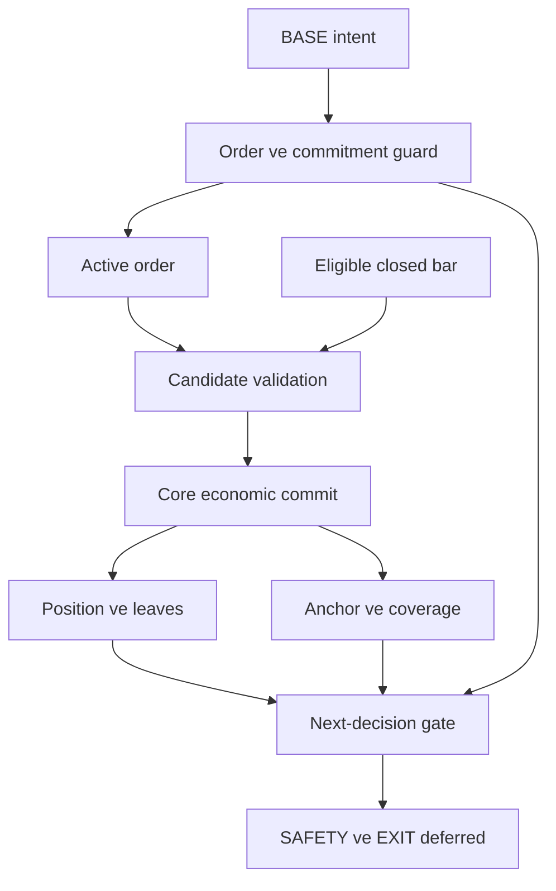

# Strict fixed-limit gözleminin DCA durum makinesine bağlanması: bağımsız kanıt değerlendirmesi

## 1. Karar özeti

**Production binding kararı: DEFER. Araştırma kapsamı için seçenek: SIMPLIFY.** Strict fixed-limit OHLCV gözlemi, long-only DCA çekirdeğine aday olay sağlamak için kullanılabilir. Ancak gözlem kuralının belirli bir bardaki fiyat koşulunu hesaplaması; emrin hâlâ geçerli olduğunu, risk kapasitesinin ayrıldığını, miktar ve ücretin yalnız bir kez işlendiğini veya bir sonraki strateji kararının güvenli olduğunu kanıtlamaz. Bağlamanın güvenilirliği, policy fonksiyonunun doğruluğundan daha geniş bir kanıt gerektirir.

“Henüz güvenli bir adapter olarak bağlanmış değildir” ifadesi mevcut local implementasyon hakkında bir iddiadır. İncelenen malzeme anonim gereksinim metnidir; local reducer, risk fonksiyonu veya gerçek test sonucu içermez. Bu nedenle mevcut adapter’ın olmadığı, hatalı olduğu veya çalıştığı sonucuna varılamaz. Doğru epistemik sonuç **LOCAL-CODE-REQUIRED: güvenli binding gösterilmiş değil** biçimindedir. Kanıt sunulmamış olması, kodun bulunmadığının kanıtı değildir.

“Reserve lifecycle, BASE-only uçtan uca ekonomik posting ve binding invariant’ları gösterilmeden production’a geçilmemeli” koşulu, verilen risk modeli için savunulabilir bir kabul kapısıdır. Emir durumu, gerçekleşme miktarı ve gerçekleşme mesajının amacı resmî FIX modelinde ayrı kavramlardır; dış venue belgelerinde de emir kabulü, kısmi gerçekleşme ve hold ayrı aşamalardır. Bunlar local güvenlik tasarımının gerekçesini destekler; belirli bir local branch’in doğru çalıştığını göstermez. [S01](https://fiximate.fixtrading.org/en/FIX.Latest/msg9.html), [S03](https://docs.cdp.coinbase.com/api-reference/exchange-api/rest-api/orders/create-new-order).

Bu raporun önerisi, ekonomik state’i değiştirmeyen observation/candidate sınırını açık tutmak; BASE-only için aşağıdaki local kapıları kapattıktan sonra production kararını yeniden vermektir. SAFETY ve EXIT bu ilk kapsama dahil edilmemelidir. Bu, onların teknik olarak aynı limit predicate’ini paylaşamayacağı anlamına gelmez; farklı ekonomik bağımlılıklarının ayrıca kanıtlanması gerektiği anlamına gelir.

Çalışmanın değerlendirme tarihi 9 Eylül 2026’dır. Yalnız long-only tarihsel DCA, BASE entry ve diğer rollerin sınırları ele alınır. Gerçek borsa execution’ı, live/testnet, performans, order-book/queue replay, yeni fee/reserve/slippage formülü ve ürün arayüzü tasarımı kapsam dışıdır. Paket içindeki bütün sayısal veriler anonim, yapay araştırma örnekleridir.

Durum: LOCAL-CODE-REQUIRED  
Kanıt: [Gate durumları](../03_test_ve_gate/Minimum_Local_Evidence_Gate.md), S01 ve S03 genel dayanakları.  
Production etkisi: Ertele; salt observation/candidate araştırması sürdürülebilir.  
Eksik kapanış koşulu: Gate A–D’nin her satırına gerçek local kanıt ve bağımsız doğrulama sonucu eklenmesi.

## 2. Doğrulanan, koşullu ve kanıtsız iddialar

### 2.1 Sınıflandırmanın anlamı

| Sınıf | Bu rapordaki kesin anlamı |
| --- | --- |
| CONFIRMED | Kaynağın doğrudan desteklediği genel ilke veya açık baseline’dan mantıksal olarak çıkan kural. Local implementasyonun doğrulandığı anlamına gelmez. |
| CONDITIONAL | Doğruluk; karar zamanı, domain sözleşmesi, yetki ayrımı veya seçilen simülasyon profiline bağlıdır. |
| UNSUPPORTED | Mevcut malzeme bu sonucu desteklemez; iddiayı daha güçlü biçimde kurmak gerekçesiz olur. |
| LOCAL-CODE-REQUIRED | Mevcut local davranış ancak ilgili tanım, çağrı zinciri ve testlerle değerlendirilebilir. |

Karar matrisinde “placement barı eligible olmamalı” CONDITIONAL’dır; çünkü tüm backtester’lar için evrensel bir yasak değildir. Bununla birlikte verilen **placement sonrası closed bar** baseline’ı içinde bağlayıcıdır. Aynı biçimde equality’nin fill olmaması bu strict profil içinde CONFIRMED’dır; gerçek limit emirlerinde equality’nin hiçbir zaman gerçekleşmeyeceği iddiası değildir.

### 2.2 Zorunlu karar matrisi

| İddia | Sınıf | Kaynak/kanıt | Local code’da ayrıca ne kanıtlanmalı? | Production etkisi |
| --- | --- | --- | --- | --- |
| Generic fixed-limit policy DCA state-machine’e doğrudan bağlanmamalı | CONDITIONAL | S01, S03 ve authority karşı örneği | Guard, lifecycle ve tek ekonomik commit sahibi | Guardsız bağlamayı ertele; güvenli doğrudan fonksiyon çağrısını kategorik yasaklama |
| BASE-only ilk aday olarak daha küçük kapsamlıdır | CONDITIONAL | Baseline rol bağımlılıkları; §7 ve §12 | Initial predicate; yalnız BASE reachability | İlk kanıt kapsamı olarak tercih et |
| Observation ve economic fill ayrılmalıdır | CONFIRMED | Baseline, S01 ve S04 bilgi sınırı | Candidate üretiminde ekonomik no-op | Semantik ayrımı zorunlu tut |
| Pending BASE reserve lifecycle’ı binding blocker’ıdır | LOCAL-CODE-REQUIRED | S03 yalnız dış örnek; Gate A09/D | Owner, acquisition, partial transfer, release ve EOF | Gate kapanana kadar ertele |
| BASE anchor adapter’da değil core’da sahiplenilmelidir | CONDITIONAL | Baseline tek authority; §9 tasarım çıkarımı | Anchor yazan tek owner ve event | Bağımsız ikinci anchor hesabını reddet |
| Placement barı fill için eligible olmamalıdır | CONDITIONAL | Baseline, S05–S07 | Intent’in information boundary’si | Bu profilde zorunlu |
| Equality touch tek başına strict synthetic fill üretmemelidir | CONFIRMED | Strict baseline; S06 örneği | Exact kıyas ve equality no-op | Bu profilde zorunlu |
| Ambiguous same-bar ordering’de yeni ekonomik commit yapılmamalıdır | CONDITIONAL | S04, S05; iki yol karşı örneği | İlk belirsiz olayın önce saptanması | Prefix koruyan durdurmayı doğrula |
| EOF pending order sentetik olarak kapatılmamalıdır | CONDITIONAL | Baseline; EOF ile TIF ayrı kavramlar | EOF kaynaklı terminal ekonomik event yokluğu | OPEN_AT_END koru |
| Duplicate/late fill idempotency kanıtı gerekir | CONFIRMED | S01, S14; tekrar yan etkisi karşı örneği | Aynı payload, mismatch ve yeni late ayrımı | Kanıt öncesi ertele |
| SAFETY ve EXIT BASE ile aynı ilk fazda açılmamalıdır | CONDITIONAL | Baseline aşamalandırma; §12 | Role guard ve legacy izolasyonu | Bu ilk fazda explicit deferred |

Kaynakların doğrudan bağlantıları ve destek sınırları §18’dedir. Aynı matrisin ayrı ve makinelerce okunabilir sürümleri [karar matrisi](../03_test_ve_gate/Iddia_Karar_Matrisi.md) ve [iddia kayıtları](../03_test_ve_gate/iddialar.json) içindedir.

### 2.3 Desteklenmeyen güçlendirmeler

| Güçlendirilmiş iddia | Sınıf | Gerekçe |
| --- | --- | --- |
| Private adapter’ın mevcut olmadığı kanıtlandı | LOCAL-CODE-REQUIRED | Repository veya sembol kanıtı yok. |
| Strict penetration gerçek fill garantisidir | UNSUPPORTED | Fiyat özeti belirli emrin gerçekleşmesini ve miktarını göstermez. |
| Her venue fixed declared-limit fiyatını kullanır | UNSUPPORTED | Limit veya daha iyi fiyat davranışı resmî dış örneklerde mümkündür. |
| Her DCA aynı reserve formülünü kullanmalıdır | UNSUPPORTED | Domain modeli ve kaynak birimi verilmemiştir. |
| Her BASE partial fill anchor oluşturamaz | UNSUPPORTED | Kural domain’e bağlıdır; seçilen ilk aday daha dar olabilir. |
| Decimal kullanılmışsa muhasebe doğrudur | UNSUPPORTED | Temsil, arithmetic context, rounding ve asset allocation ayrı sorulardır. |
| Oracle PASS ise production ACCEPT olur | UNSUPPORTED | Araştırma oracle’ı local çağrı zincirini çalıştırmaz. |

Durum: CONDITIONAL  
Kanıt: C01–C11 matrisi, baseline ve §18 kaynakları.  
Production etkisi: Koşullu maddeleri model sözleşmesine bağla; local sonuç iddiasını ertele.  
Eksik kapanış koşulu: Her koşullu madde için seçilen profile ait tek anlamlı kabul hükmünün yazılması.

## 3. İddianın her cümlesi için kanıt tablosu

Ana iddia iki cümleden oluşur; değerlendirme için altı denetlenebilir parçaya ayrılmalıdır.

| Parça | Kanıt türü | Sonuç | Gerekli karşı kontrol |
| --- | --- | --- | --- |
| Strict fixed-limit historical observation policy tanımlanabilir | Baseline sözleşmesi + external model örnekleri | CONDITIONAL: belirtilen immutable identity, timing, strict kıyas ve sabit fiyatla tutarlı bir sentetik profil kurulabilir | T01–03,T17,T21–23 |
| Policy “henüz bağlanmış değildir” | Local-code evidence | LOCAL-CODE-REQUIRED: mevcut/yok hükmü kurulamaz | Gerçek karar→adapter→reducer çağrı zinciri |
| Policy güvenli adapter olarak bağlı değildir | Local-code evidence + kabul ölçütü | LOCAL-CODE-REQUIRED: güvenli olduğuna ilişkin kanıt sunulmamış | Guard bypass ve gerçek integration transition |
| Reserve lifecycle kanıtı gerekir | Domain/risk çıkarımı | CONDITIONAL: risk kapasitesini kısıtlayan bu baseline için gerekli | Pending→partial→EOF commitment referansı |
| BASE-only end-to-end economic posting ve invariant kanıtı gerekir | Bu faz için kabul sözleşmesi | CONDITIONAL: daha dar, incelenebilir bir ilk acceptance paketi | Gate C’nin gerçek entrypoint’ten çalıştırılması |
| Bu kanıtlar yokken production binding uygulanmamalı | Kabul kararı | DEFER: eksik gate’lerin doğal sonucu | Her gate için ölçülebilir GREEN + bağımsız kontrol |

Bir policy’nin teknik olarak çağrılabilir olması yalnız tip/akış uyumluluğunu gösterebilir. Örneğin `low < limit` sonucunu bir BUY event’ine çevirmek kolaydır; ancak aynı order için ikinci callback’in fee ve reserve’ü tekrar işlemesini önleyen bir sözleşme yoksa pozisyon yanlış büyür. Bu, basit bir karşı örnektir; herhangi bir local sistemde gerçekleştiği iddia edilmemektedir.

“Doğrudan bağlanmamalı” ifadesinin en savunulabilir yorumu, **ekonomik doğrulama sınırı atlanmamalı** biçimindedir. Tek bir reducer fonksiyonunun içinde observation doğrulaması ve commit yapılması da güvenli olabilir; ayrı servis, kuyruk veya sınıf zorunluluğu çıkarılamaz. Buradaki gereklilik, yetki ve atomic transition sınırıdır. Önerilen candidate nesnesi bu sınırı görünür kılan bir tasarım aracıdır.

Durum: LOCAL-CODE-REQUIRED  
Kanıt: Ana iddia ayrıştırması; T08 ve T30 mantıksal karşı örnekleri.  
Production etkisi: Genel tasarım gerekçesini kabul et; mevcut kod hakkında hüküm verme.  
Eksik kapanış koşulu: Gerçek BASE FILL için tek bir uçtan uca event/state izinin bütün owner’ları göstermesi.

## 4. External evidence sınırları

FIX, quantity ve emir durumu için yararlı bir kavramsal referanstır; DCA strateji domain’i değildir. `ExecID` bulunması, local replay kimliğinin aynı alanı kullanması gerektiğini söylemez. FIX execution correction akışlarını yok sayıp bütün terminal sonrası mesajları “imkânsız” ilan etmek de doğru değildir. Belgenin genel order-state senaryoları ve exchange’e özgü terminal-state rehberi bağlamlarıyla okunmalıdır. [S02](https://www.fixtrading.org/wp-content/uploads/download-manager-files/FIX-Latest-as-of-EP284-Order-State-Changes.pdf).

Resmî backtest kaynakları tek bir evrensel fill modeli ortaya koymaz. TradingView kendi intrabar varsayımlarını ve ayarlarını açıklar; QuantConnect’in belirli fill modelinde strict koşullar vardır; Backtrader uygun açılışta price improvement gösterebilir. Bu kaynaklar, model tercihlerinin açık belgelenmesini destekler. Hiçbiri bu raporun baseline’ını bütünüyle doğrulanmış bir venue execution modeli yapmaz. [S05](https://www.tradingview.com/pine-script-docs/concepts/strategies/), [S06](https://www.quantconnect.com/docs/v2/writing-algorithms/reality-modeling/trade-fills/supported-models/immediate-model), [S07](https://www.backtrader.com/docu/order-creation-execution/order-creation-execution/).

| External kanıtın sağladığı şey | Sağlamadığı şey |
| --- | --- |
| Emir kabulü, fill ve order-status ayrımının dış örnekleri | Local INTENT/FILL branch’lerinin gerçek davranışı |
| OHLC bucket alanlarının anlamı | Belirli emrin gerçekleşmesi, intrabar yol veya queue konumu |
| Hold ve partial execution örneği | Local reserve owner/formül/para birimi |
| Sayı ve serialization semantiği | Domain rounding, fee allocation veya anchor doğruluğu |
| Idempotent yan etki ilkesi | Local event kimliği, replay scope veya recovery uygulaması |
| Farklı backtest varsayımları | Seçilen profilin finansal sonuçlarının gerçeklikle aynı olması |

Kaynak güncelliği de aynı ayrımın parçasıdır. FIX EP284 belgesi Kasım 2023 tarihli sabit bir referans; FIX.Latest değişebilir bir görünüm; Python sayfaları erişimde 3.14.7 olarak görünmektedir. Bunların local runtime veya model sürümü olduğu varsayılmaz. Yayın tarihi belirtilmeyen sayfalarda erişim tarihi kaydedilmiştir; arama motorunun tarama tarihi yayın tarihi gibi kullanılmamıştır.

İçeriğinde limit veya order geçen üçüncü taraf yazılar karar kanıtı yapılmamıştır. Tam metni açılan birincil kaynaklar kullanılmıştır. FIX 4.2 LeavesQty bağımsız sayfası tekrar erişimde hata verdiği için bu alanın kanıtı, erişilen FIX.Latest ExecutionReport satırına bağlanmıştır. Kaynak kartları kısa alıntı, tam URL ve bölüm konumu içerir; tam web sayfası/PDF arşivi olarak sunulmaz.

Durum: CONFIRMED  
Kanıt: S01–S15 kaynak envanteri ve her kartın “taşınamayacak sonuç” alanı.  
Production etkisi: External kanıtı tasarım gerekçesi olarak kullan; local gate yerine koyma.  
Eksik kapanış koşulu: External atıfla kapatılmış görünen bütün local maddelerin yeniden LOCAL-CODE-REQUIRED olarak işaretlenmesi.

## 5. Local-code evidence eksikleri

### 5.1 Gate A — Reducer claim inventory

Her satırın şu anki durumu **KANIT YOK**tur. Aşağıdaki inventory, bulunmuş dosya listesi değil, gerekli sembol/test rolleridir. Ayrı [minimum gate belgesi](../03_test_ve_gate/Minimum_Local_Evidence_Gate.md) input fixture, transition, counterexample ve ekonomik riski birlikte içerir.

| Gate | Kanıtlanacak claim | İlgili parça/test türü | Temel input ve beklenen transition | Counterexample / risk |
| --- | --- | --- | --- | --- |
| A01 | Kabul edilen INTENT order active yapar | State/Order tipleri, intent reducer ve çağıran test | Boş state→tek order; activation ayrıysa explicit boundary | T07/T27; var olmayan emrin fill edilmesi |
| A02 | INTENT trade posting yapmaz | INTENT branch unit/integration | Valid intent→qty/cost/fee/realized sabit; commitment ayrı | T01/T30; hayalet position |
| A03 | FILL trade accounting’in tek yetkili girişi | FILL, MARK, FINAL ve mutation audit | Candidate/mark/final trade ledgerı değiştirmez | T25/T26/T30; gizli ekonomik etki |
| A04 | Partial fill exact leaves üretir | Quantity helper ve reducer testi | .30 original, .10 fill→.20 leaves | T04/T18; overfill veya rounding |
| A05 | Duplicate ikinci posting yapmaz | Dedupe guard + lifecycle testi | Aynı event iki kez→ikinci ekonomik delta0 | T08/T16/T20; double qty/fee |
| A06 | Yeni late fill fail-closed olur | Final/FILL validation | Final sonrası unknown event→unresolved | T09; sessiz yeniden açma |
| A07 | BASE anchor timing açık | Anchor owner ve decision call site | Partial/full/final ayrı sınırlar | T06/T30; yanlış ladder |
| A08 | Coverage complete tanımlı | Final/coverage aggregate | Qty full fakat kanıt çelişkili→complete değil | T05/T19; erken safety |
| A09 | Pending/unresolved risk blocker | Pending predicate, risk gate | O1 pending→ikinci BASE/SAFETY kabul edilmez | T07/T29; double commitment |
| A10 | Fee/slippage tek authoritative pipeline | Economic helper ve bütün çağıranlar | Tek FILL→tek fee; sabit fiyat bozulmaz | T14/T24; iki kez ücret |
| A11 | ORDER_FINAL position ile order’ı ayırır | Final branch ve position predicate | BASE order kapanır; position açık kalır | T11/T19; sahte flat state |

**Önemli kapsam düzeltmesi:** “Yalnız FILL ekonomik state’i değiştirir” ifadesi literal olarak bütün alanlara uygulanırsa reserve lifecycle ile çelişebilir. INTENT/activation commitment ayırabilir; gerçek iptal kalan commitment’ı serbest bırakabilir; MARK valuation güncelleyebilir. Kanıtlanması gereken dar iddia, **trade execution miktarı, trade maliyeti, realized posting ve fill fee etkisinin tek authoritative pipeline’a ait olmasıdır**. Reserve, blocker ve valuation alanlarının yetkili lifecycle olayları ayrıca yazılmalıdır.

### 5.2 Gate B — Historical timing proof

Strategy decision’ın bar close öncesi mi sonrası mı üretildiği, input barın open/close timestamp anlamı ve eligible boundary birlikte gösterilmelidir. Aynı sayısal bar index’inin farklı veri kümelerinde aynı bar sanılmaması gerekir. Kapanmamış, yinelenen veya sırası bozuk input için davranış açıklanmalıdır. Bir test yalnız fill predicate’ini çağırıyorsa strateji kararındaki look-ahead riskini kapatmaz; gerçek event sırası fixture’da bulunmalıdır.

### 5.3 Gate C — BASE-only integration

Test gerçek decision entrypoint’ten başlayıp active order, placement identity, next-bar observation, candidate guard, FILL, leaves, final coverage, anchor ve next decision’a ulaşmalıdır. Yalnız adapter helper’ını çağıran bir unit test yeterli değildir. No-fill, partial ve full+valid-final ayrı koşulardır. İlk slice içinde SAFETY/EXIT’e ulaşılması ya açık rejection üretmeli ya da test reachability kanıtıyla imkânsız olmalıdır.

### 5.4 Gate D — Exact accounting

Independent expected-state tablosu; original, filled, leaves, price, fee **tutarı ve varlığı**, position quantity, position cost, anchor, reserve/commitment, open/final ve integrity durumlarını kapsamalıdır. Domain sonucu bilinmeyen reserve veya anchor hücresine `0` yazmak kanıt üretmez. Bu hücreler `LOCAL-CODE-REQUIRED` kalmalıdır. Araştırma oracle’ı bu ayrımı korur ve yalnız tanımlanmış sayısal ilişkileri doğrular.

Durum: LOCAL-CODE-REQUIRED  
Kanıt: A01–A11, B, C, D; hiçbir local yürütme sonucu verilmedi.  
Production etkisi: Dört ana gate kapalı; 14 inventory satırı eksik kanıt nedeniyle BLOCKED.  
Eksik kapanış koşulu: Her inventory satırının ayrı bir gerçek input→observed state→independent expected state kaydıyla kapatılması.

## 6. Gerekli anonim code request

Lütfen yalnız aşağıdaki anonim kod parçalarını gönderin:

1. **State/Order/Position ve immutable value type tanımları:** sınıf/fonksiyon adlarını koruyun; özel dosya yolu, proje adı, kullanıcı adı ve gerçek sembol değerlerini maskeleyin. Role, side, quantity, price, placement identity, model/config identity, pending/unsettled, final/coverage ve anchor alanlarının tanımı yeterlidir.
2. **Event reducer:** INTENT, FILL, ORDER_FINAL, UNKNOWN ve MARK branch’lerini; bunların çağırdığı reserve/blocker/anchor güncellemelerini gönderin. Ekonomik state’e ulaşan ilgili çağıran bölümü de dahil edin. Dış servis ve kimlik bilgisi satırlarını çıkarın.
3. **Risk ve strateji karar fonksiyonları:** pending order, commitment/reserve gate, BASE anchor, safety ladder/index/coverage ve next-decision blocker hesabını gösteren dar parçalar yeterlidir. Bütün strateji dosyası gerekmez.
4. **Historical decision adapter ve fixed-limit policy:** bar index/time, closed-bar doğrulaması, placement/eligible kararı, observation/result dataclass’ları, trigger, candidate payload’ı ve reducer çağrısını gönderin.
5. **Exact conversion ve identity yardımcıları:** fee/slippage sahipliği, quantity/tick dönüşümü ve config hash/model-version canonicalization’ının ilgili anonim bölümlerini gönderin. Mevcut dedupe veya kayıt üzerinden replay davranışı varsa yalnız ilgili küçük parça yeterlidir; yeni persistence tasarımı istenmiyor.
6. **İlgili testler:** test adı, fixture, açık event sırası, beklenen state/result; duplicate, yeni late fill, ambiguity, EOF, partial/full BASE, reserve ve legacy vakalarını gönderin. Beklenen değeri aynı production helper’ından üreten kısmı varsa açıkça belirtin.

Whole repository, bütün test klasörü, secret, `.env`, credential, veritabanı dökümü, private URL, gerçek hesap kimliği veya kişisel path göndermeyin. Kod yalnız tasarım örneğiyse **PROPOSED DESIGN** olarak etiketleyin; bu, çalışmakta olan implementasyon kanıtı sayılmayacaktır.

Kod geldiğinde önce sembolün gerçekten çağrı zincirine bağlılığı, sonra event sırası ve mutasyon sahibi incelenmelidir. Testin kendi expected sonucunu aynı production helper ile üretip üretmediği ayrıca denetlenmelidir. Tek bir sembol eksikliği değerlendirmeyi engellerse sadece o parça ve kapattığı claim istenmelidir. Bu aşamada geniş repository, yeni API veya migration çalışması talep edilmez.

Bu istek ayrıca [Anonim_Kod_Talebi.md](../05_kod_talebi/Anonim_Kod_Talebi.md) dosyasında paylaşılabilir biçimdedir.

Durum: LOCAL-CODE-REQUIRED  
Kanıt: §5’teki eksik sembol/test rolleri.  
Production etkisi: Kod incelemesi için dar kanıt topla; binding implementation’ını ertele.  
Eksik kapanış koşulu: A01–A11’i kapsayan anonim reducer, çağrı zinciri ve ilgili fixture’ların sağlanması.

## 7. BASE-only lifecycle ve veri akışı

### 7.1 BASE neden daha küçük ilk adaydır?

BASE, yeni DCA döngüsünde pozisyonu ilk açan emir olarak tanımlanırsa önceki safety coverage veya ladder index’e dayanmak zorunda değildir. SAFETY mevcut anchor ve geçmiş safety adımlarını; EXIT mevcut position ve realized accounting’i gerektirir. Bu göreli küçüklük baseline’dan çıkar; her üründe BASE’in basit olduğunu garanti etmez. BASE için de reserve, order identity, partial fill, fee ve late event yükümlülükleri kalır.

Başlangıç precondition’ı açık olmalıdır: yeni döngü, izin verilen position predicate’i, unresolved risk bulunmaması, valid quantity/price ve model identity. “Pozisyon sıfır” tek başına yeterli değildir; no-fill pending BASE varken position sıfır kalır, fakat ikinci BASE riski açılmamalıdır. Benzer şekilde partial position mevcut olması order’ın tamamlandığını göstermez.

### 7.2 Bağımlılık haritası

Harita uygulama modülü veya thread topolojisi değildir. Mantıksal bağımlılık gösterir. Reserve kontrolü activation’da başlar; accepted FILL sonrası domain’e göre değişir; next-decision anında tekrar geçerli state üzerinden değerlendirilir.

### 7.3 Owner ve mutation contract

| Adım | Girdi | Mutasyon yetkisi | Çıkış | Kanıt |
| --- | --- | --- | --- | --- |
| Strategy decision | Core state, izin verilen geçmiş, explicit profile | Decision katmanı intent üretir; trade ledger yazamaz | Role=BASE, immutable order identity, quantity, declared limit, placement identity | Baseline; A01/A02 ve B local gerekli |
| Order activation | Valid intent, mevcut blocker/commitment | Order reducer; kabul ve risk commitment domain owner’ında | Active order, eligible-from, pending blocker | S03 yalnız analoji; A01/A09 |
| Market observation | Immutable active-order view + canonical closed bar | Policy economic mutation yapamaz | NONE/EQUALITY_TOUCH/STRICT_PENETRATION; uygun değilse eligibility rejection | Baseline; S04/S06; B |
| Synthetic candidate | Strict observation, kalan miktar ve tanımlı slice | Adapter yalnız aday veri üretir | Order/bar ID, slice identity, quantity, declared-limit price, model provenance | Önerilen tasarım; T03/T17/T30 |
| Economic commit | Candidate + güncel authoritative state | Core reducer ve onun tek domain authority’si | Position, cost, fee, realized, filled/leaves; reserve/blocker transition | A03–A10; D |
| Order finalization | Committed execution coverage + final observation | Core lifecycle; gerçekleşmemiş miktarı dolduramaz | Valid FILLED veya explicit unresolved; EOF için run-level OPEN_AT_END | A08/A11; T11/T19 |
| Next decision | Commit/final sonrası core state | Core decision; role/risk guard | İzinli BASE/no-new-risk; SAFETY/EXIT bu fazda deferred | A09, C; T05/T07/T27 |

`CANCELED` genel lifecycle’da gerçek ve yetkili cancel nedeni bulunduğunda anlamlıdır. Bu tarihsel baseline’da EOF’den türetilemez. `OPEN_AT_END` de `FILLED` veya `CANCELED` ile aynı tür terminal economic state kabul edilmemelidir; bu ayrım §10’da açıklanmıştır.

### 7.4 Reducer validation için asgari sıra

Bu sıra **PROPOSED CONTRACT**tır; local fonksiyon adı değildir. Önce event namespace ve immutable identity doğrulanır. Daha önce işlenmiş kimlik varsa payload eşitliği kontrol edilir: aynı içerik duplicate no-op, farklı içerik conflict olur. Yeni kimlikte order’ın geçerli/active/eligible durumu, role izinleri, bar sırası, quantity sınırı, bir bar bir slice kuralı ve ambiguity kontrol edilir. Commitment ve exact-price/fee sahibi doğrulanmadan economic transition kabul edilmez.

Accepted transition; quantity, cost, fee, leaves, commitment ve dedupe bilgisini tutarlı bir state olarak üretmelidir. Bir alan yazılıp diğerinin hata almasıyla ara ekonomik durum bırakılmamalıdır. Next decision bu tutarlı son state’ten çalışır. Bu bir database veya persistence migration önerisi değildir; pure reducer’da dahi input state’i kısmen değiştirmeden yeni state üretmenin acceptance koşuludur.

Durum: CONDITIONAL  
Kanıt: Baseline + A01–A11/C; veri akışı PROPOSED CONTRACT olarak etiketlidir.  
Production etkisi: BASE-only entegrasyon testine dönüştür; runtime’a bağlama öncesi bütün owner’ları doğrula.  
Eksik kapanış koşulu: Her veri akışı satırının gerçek çağrılan sembol ve test event’iyle eşleştirilmesi.

## 8. Reserve lifecycle analizi

### 8.1 Pending BASE commitment gerektirir mi?

Bu baseline yeni riskin pending/unresolved order varken engellenmesini ister. Bunun anlamı, pending BASE’in risk kapasitesi açısından görünür olmasıdır. Bunun mutlaka `reserve` adlı parasal bir alanla gerçekleştirilmesi gerekmez: nakit hold, mevcut bütçe tahsisi veya domain’in doğruladığı bir commitment/risk gate olabilir. Adı ne olursa olsun aynı kapasitenin eşzamanlı iki emre harcanamaması kanıtlanmalıdır.

Coinbase’in hold belgesi, bekleyen emre kaynak ayırma ile trade anındaki ücretlendirme arasındaki ayrımın resmî bir dış örneğidir. Buradan local reserve tutarı veya tüm lifecycle’a uygulanacak bir formül çıkarılmaz. Özellikle quote/base para birimi, fee’nin bütçeye dahil edilmesi ve risk kapasitesi tanımı local domain sözleşmesinden gelmelidir. [S03](https://docs.cdp.coinbase.com/api-reference/exchange-api/rest-api/orders/create-new-order).

### 8.2 Commitment ne zaman ele alınabilir?

| Aşama | Kabul edilebilir yorum | Kanıtlanması gereken sınır |
| --- | --- | --- |
| INTENT üretimi | Yalnız öneri ise mali reserve ayırmayabilir | Intent ile accepted order farklıysa aradaki risk yeniden doğrulanmalı |
| INTENT kabulü / activation | Risk commitment’ı burada authoritative olabilir | Order active olurken aynı anda blocker/risk state tutarlı olmalı |
| Candidate üretimi | Mevcut kapasite doğrulanabilir; yeni authority yaratmamalı | Pending aşaması daha önce bütçesiz bırakılmamalı; tek exception açık domain proof ister |
| FILL commit | Commitment gerçekleşen ekonomik exposure’a dönüştürülür veya domain’e göre çözülür | Kalan order commitment’ı korunmalı; qty ve reserve bir kez işlenmeli |

Sadece FILL anında cash düşülmesi, pending riskin başka bir mekanizma ile güvenli biçimde tutulduğunu gösteriyorsa mümkündür. “Cash yalnız FILL’de değişiyor; dolayısıyla reserve’e gerek yok” sonucu geçerli değildir. Kanıtın amacı belirli bir formülü dayatmak değil, order yaşam döngüsünün tamamında kapasite aşımının engellendiğini göstermektir.

### 8.3 Ön/post reserve matrisi

`R_before` ve `R_after` sembolleri sayısal formül değil, domain’in mevcut commitment state’ini temsil eder.

| Olay | Beklenen lifecycle ilişkisi | Yasak varsayım |
| --- | --- | --- |
| Accepted activation | Pending order risk gate’te görünür | Sıfır pozisyon varsa sıfır commitment vardır |
| No-touch / equality | Fill-consumption yok; mevcut pending yükümlülük sürer | Fiyat değdi diye fee veya reserve tüketmek |
| Strict candidate | Salt candidate ekonomik rezerv sahibi olmaz | Reducer kabulünden önce kalıcı reserve azaltmak |
| Partial accepted FILL | İşlenen miktar bir kez etkilenir; leaves için yükümlülük domain’e uygun sürer | Her partial’da reserve’ü tümden sıfırlamak veya aynı tutarı iki kez ayırmak |
| Full FILL, final eksik | Leaves sıfır olabilir; coverage-integrity blocker ayrı sürer | Sayısal reserve0 ise bütün belirsizlik kapandı |
| Valid final | Trade/commitment kapanışı domain ile uzlaşır | Final event’i ikinci defa trade post eder |
| Ambiguous bar | Bilinen ekonomik prefix korunur; unresolved risk serbest bırakılmaz | Belirsizlik pahasına yeni risk kapasitesi açmak |
| EOF pending | Kalan yükümlülük ve açık exposure son state’te görünür | Veri bitti diye remaining commitment’ı cancel gibi çözmek |

Eğer domain mark-to-market tabanlı bir risk ölçütü içeriyorsa equality sırasında valuation temelli risk değeri değişebilir; bu değişiklik **fill-consumption değildir** ve yalnız mevcut contract ile kabul edilir. Mevcut bilgilerle yeni mark/reserve formülü eklenmez. Bu ayrım, “equality’de bütün alanlar her koşulda değişmez” gibi fazla güçlü bir hüküm kurulmasını önler.

### 8.4 Blocker’ı kapatacak kanıt

Gerekli fixture `accepted intent → active → partial → equality → EOF` sırasını göstermelidir. Her satır için supplied domain reference’ta kaynak varlığı, ayrılmış/serbest kapasite, filled/leaves ve blocker sonucu yazılmalıdır. Beklenen reserve’ü production reserve helper’ını çağırarak üretmek bağımsız kontrol değildir. Domain sahibi referans vermedikçe bu sütunlar KANIT YOK kalır; sayısal uydurma yapılmaz.

Durum: LOCAL-CODE-REQUIRED  
Kanıt: S03 dış analoji; A09/D ve T29 gerekli local kanıt.  
Production etkisi: Reserve owner veya lifecycle belirsizse otomatik DEFER.  
Eksik kapanış koşulu: T29’un bağımsız domain commitment tablosuyla bütün geçişlerde eşleşmesi.

## 9. Anchor/coverage/position/order ayrımı

### 9.1 Anchor hangi event’in sonucu olabilir?

Anchor’ın event’i dış kaynaklardan çıkarılamaz. Bazı açık domain sözleşmeleri ilk accepted BASE fill’i yeterli sayabilir; bazıları full quantity ve valid final coverage bekleyebilir. Bu raporun konservatif ilk adayında **full BASE ve geçerli final coverage öncesi SAFETY açılmaz**. Anchor’ın numeric olarak erken oluşturulması ile sonraki risk için kullanılabilir sayılması da ayrı tanımlar olabilir; local contract ikisini açıkça ayırmalıdır.

Adapter aynı barın limit veya close fiyatından kendi anchor’ını hesaplayıp çekirdek ise filled maliyetlerden başka değer üretirse iki source of truth oluşur. Burada sorun yardımcı fonksiyonun fiziksel konumu değil, bağımsız ikinci otoritedir. Core’un tek, saf domain helper’ına hesap yaptırması güvenli olabilir; aynı değerlerin ayrı state sahiplerince farklı zamanda yazılması test gerektiren risk bulgusudur.

### 9.2 Anchor ne zaman average/cost basis ile eşit olabilir?

Yalnız ilgili domain anchor’ı execution-weighted fiyat olarak tanımlıyorsa; aynı kapsamdaki fill’ler kullanılıyorsa; ücret, allocation ve rounding aynı tanımla ele alınıyorsa eşitlik beklenebilir. Fixed-limit BASE fill’lerinin tamamı aynı fiyatı taşıdığında **gross execution average** limit fiyatına eşittir. Bundan fee-inclusive cost basis’in veya strateji anchor’ının zorunlu olarak aynı olduğu sonucu çıkmaz.

Örneğin .10’ar üç fill, 100.10 fiyatıyla toplam gross notional 30.030 üretir. Fee’nin ayrı quote gideri, maliyete eklenen quote tutarı veya base quantity’den kesilen varlık olması farklı net yorumlar doğurabilir. Burada bunlardan hiçbiri local kural olarak seçilmez. Oracle yalnız verilen fee tutarlarını ayrı varlık ledgerında toplar; `anchor` ve `domain_position_cost` alanlarını doğrulanmamış bırakır.

### 9.3 Coverage quantity’den daha geniştir

Full quantity, emrin original miktarının accepted fills ile karşılandığını söyler. Valid coverage ise hangi events’in kabul edildiğini, final sonucunun bunlarla tutarlı olup olmadığını ve unresolved çelişki bulunup bulunmadığını kapsar. Local coverage tanımı ayrıca bar gözlem kapsamı veya event sequence gerektiriyorsa bunlar ayrı explicit alanlardır; dış FIX alanlarından icat edilemez.

FIX LeavesQty bazı terminal durumlarda sıfır olabilir; bu yüzden dış protokolde `leaves=0` her zaman “tam gerçekleşti” anlamına gelmez. Bu baseline’ın `filled + leaves = original` ilişkisi iptalsiz ve immutable quantity akışında korunur. İleride explicit cancel desteklenirse ekonomik olarak doldurulmamış residual miktar ile protokolün executable leaves alanı aynı anlama zorlanmamalıdır. [S01](https://fiximate.fixtrading.org/en/FIX.Latest/msg9.html).

### 9.4 Ayrı durum eksenleri

| Vaka | Open position | Open/pending order | Coverage / integrity |
| --- | --- | --- | --- |
| BASE active, hiç fill yok | Hayır | Evet | Incomplete |
| BASE partial | Evet, yalnız gerçekleşmiş miktar | Evet, leaves kadar | Incomplete |
| BASE full, final eksik | Evet | Executable leaves0; lifecycle/finalization tanımı ayrı | Henüz kanıtlanmış complete değil |
| BASE full, valid final | Evet | Hayır | Valid complete |
| EOF partial | Evet | Kalan emir sentetik kapanmaz | OPEN_AT_END/unresolved |
| Terminal sonrası yeni bilinmeyen fill | Bilinen ekonomik prefix | Önceki terminal gözlem korunabilir; integrity unresolved | Complete artık güvenilir sayılmaz |

Son satırda fail-closed için eski terminal enum’unu mutlaka silmek gerekmez. Denetim geçmişindeki terminal gözlem saklanırken ayrı integrity durumu UNKNOWN olabilir. Gerekli sonuç, riskin açılmaması ve çelişkinin sessizce “complete” sayılmamasıdır.

Durum: LOCAL-CODE-REQUIRED  
Kanıt: A07/A08/A11, T05/T06/T19; S01 yalnız quantity/status sınırı.  
Production etkisi: Anchor event’i ve coverage predicate’i görülmeden ertele.  
Eksik kapanış koşulu: Partial, full-no-final ve full-valid-final üç fixture’ında anchor/coverage/position/order’ın ayrı doğrulanması.

## 10. Placement/look-ahead/ambiguity/EOF analizi

### 10.1 Placement information boundary

`b0` kapanışı kararın girdisi ise, b0 low/high değerleri emir yerleştirildiği anda geçmiştedir. Bu değerleri yeni emrin gerçekleşmesi için kullanmak, emir oluşmadan gerçekleşmiş fiyat hareketini emre tahsis eder. Önerilen `ACTIVE_NEXT_BAR` kontratı, b0’da kabul edilen emrin ilk kez b1’in canonical closed gözleminde değerlendirilmesini sağlar. Accepted order ile eligible order bu nedenle aynı kavram değildir.

Bu yasak yalnız “aynı bar index” etiketine bağlı mekanik bir kural olarak bırakılmamalıdır. Bar başlangıcı, kapanışı, veri kullanılabilirlik anı ve decision anı tanımlanmalıdır. Bar başlamadan yerleştirilmiş bir emrin o bar içinde gerçekleşmesini modellemek farklı bir sözleşmede mümkün olabilir; bu raporun baseline’ı öyle değildir. QuantConnect’in order timestamp verisini dışlayan örneği ve Backtrader’ın mevcut barı geçmiş sayan açıklaması, bu sınırı destekleyen dış örneklerdir. [S06](https://www.quantconnect.com/docs/v2/writing-algorithms/reality-modeling/trade-fills/supported-models/immediate-model), [S07](https://www.backtrader.com/docu/order-creation-execution/order-creation-execution/).

### 10.2 Strict ve equality truth table

| Side | Koşul | Gözlem | Ekonomik sonuç |
| --- | --- | --- | --- |
| BUY | low > limit | NONE | Yok |
| BUY | low = limit | EQUALITY_TOUCH | Yok |
| BUY | low < limit | STRICT_PENETRATION | Yalnız candidate; reducer guard sonrası olası fill |
| SELL | high < limit | NONE | Yok |
| SELL | high = limit | EQUALITY_TOUCH | Yok |
| SELL | high > limit | STRICT_PENETRATION | Yalnız generic policy adayı; EXIT bu BASE fazında deferred |

Bu tabloya eligibility, closed-bar ve canonical identity kontrolleri önkoşuldur. Strict olması tek başına fill authority değildir. `low < limit` ifadesinden fixed slice miktarı çıkarılamaz; slice miktarı mevcut profile ait bir input olmalıdır. Bir bardaki aggregate hacim, belirli limite tahsis edilebilir miktarı göstermez. Backtrader’ın ayrı filler tasarımları sunması da quantity varsayımının price trigger’dan farklı bir boyut olduğunu gösterir. [S08](https://www.backtrader.com/docu/filler/).

### 10.3 Declared-limit fiyatı ve gap karşı örneği

BUY limit100.10; sonraki bar O98/H99/L97/C98.5 olsun. Baseline strict koşulu doğrudur ve declared-limit aday fiyatı100.10’dur; bu fiyat barın high değerinin de üstündedir. Bu sonuç seçilen **synthetic fixed-price muhasebe varsayımıdır**; o barda 100.10 seviyesinde gerçek işlem gözlendiği iddia edilemez. “Fill fiyatı bar aralığında olmalı” diye ek bir kural koymak baseline’ı değiştirir; açılışa price improvement yapmak da değiştirir.

Dolayısıyla sözleşme bu edge case’i açıkça onaylamalı veya farklı profile geçiş olarak ele almalıdır. Sessiz düzeltme kabul edilmez. Gerçek limit emirlerinde daha iyi fiyat olabilmesi dış belgelerde açıklanır; fixed-limit modelin fiyatı bu davranıştan daha dar seçilmiştir. [S15](https://docs.cdp.coinbase.com/exchange/concepts/trading).

### 10.4 OHLC intrabar sırayı kanıtlamaz: yapıcı karşı örnek

İki yapay fiyat yolu:

| Yol | Zaman sıralı fiyatlar | OHLC |
| --- | --- | --- |
| A | 105 → 115 → 85 → 105 | O105/H115/L85/C105 |
| B | 105 → 85 → 115 → 105 | O105/H115/L85/C105 |

Varsayımsal BASE100, SAFETY90 ve EXIT110 eşikleri açısından Yol A’da yüksek fiyat, BASE oluşmadan önce görülür; Yol B’de yüksek fiyat düşük fiyatlardan sonra görülür. Emirlerin etkinleşme kuralları buna izin veriyorsa sonuçlar farklılaşabilir. Aynı OHLC özeti hangi yolun yaşandığını seçemez. Bu, bir backtester implementasyonu değil, bilgi kaybının matematiksel karşı örneğidir. Resmî candle tanımı bucket uçlarını/ilk-son değerlerini bildirir; intrabar rota alanı sağlamaz. [S04](https://docs.cdp.coinbase.com/api-reference/exchange-api/rest-api/products/get-product-candles).

Bu örnek, BASE-only profilin mutlaka ambiguity ürettiğini de göstermez. Eğer bütün yeni bağlı emirler sadece bir sonraki bar eligible oluyorsa aynı barda yeni SAFETY/EXIT fill zaten unreachable olur; bu, timing contract’ın ambiguity’yi azaltma yararıdır. Ambiguity guard gerçek event bağımlılığı için çalışmalıdır; “bar hem yüksek hem düşük” diye her barı gereksiz durdurmamalıdır.

### 10.5 Prefix koruma ve durdurma sınırı

İlk sıra bağımlı ekonomik olay belirlenmeden favorable bir tam sequence commit edilmemelidir. En konservatif kabul profili, ambiguity saptanan barın ekonomik batch’ini hiç commit etmeden b-1 sonundaki state’i korur. Eğer bazı bar içi events’in bütün admissible yollarda aynı güvenli prefix olduğu ayrı kanıtlanmışsa bu prefix’i korumak mümkün olabilir; böyle bir ispat verilmeden partial bar commit yapılmaz.

Bu yöntem iyimser sıra seçimi kaynaklı sahte sonuç riskini azaltır; bütün backtest sonucunun kötümser alt sınır veya unbiased tahmin olduğunu kanıtlamaz. Belirsiz koşuları sonuçlardan silmek de seçilim etkisi yaratabilir. Bu nedenle unresolved run ve ekonomik prefix birlikte raporlanmalı; belirsiz koşu tamamlanmış simülasyon sonucu gibi değerlendirilmemelidir.

### 10.6 EOF ekonomik olay değildir

EOF veri kapsamının bittiğini söyler. Zamanında gerçekleşmiş bir cancel, expiration veya exit olayını göstermez. Bu baseline’da kalan BASE için synthetic fill/cancel/expiry/forced exit üretilmez. `OPEN_AT_END`, **run observation outcome** olarak saklanabilir; order için “artık hiç gerçekleşemez” anlamında terminal execution state değildir.

Position partial açıksa miktarı ve maliyet kaydı korunur. Pending leaves ayrıca raporlanır. Commitment son state’te kaybolmamalıdır; çalışma ortamının teknik temizliği ekonomik cancel veya nakit iadesi diye yazılmamalıdır. Veri ileride uzatılırsa devam etmenin semantiği mevcut model/run identity kuralıyla ayrıca gösterilmelidir; EOF sayesinde yeni risk açılmaz.

### 10.7 Baseline’da kapanması gereken iki ayrıntı

“Bir barda en fazla bir fixed slice” sözünün **order başına mı yoksa tüm run için mi** geçerli olduğu yazılmalıdır. BASE-only tek-order aktif kapsamda sonuç aynıdır; roller açıldığında değildir. Ayrıca original miktar slice’ın katı değilse son küçük dilimin kabulü tanımlanmamıştır. `.25/.10` örneğinde son `.05` için otomatik `min(slice, leaves)` uygulamak yeni bir karar olur; bu kanıt gelene kadar T23 BLOCKED kalır.

Durum: CONDITIONAL  
Kanıt: S04–S08/S15; T01–03/T10–12/T17/T21–23; yapıcı iki yol örneği.  
Production etkisi: Baseline timing ve EOF kurallarını bağlayıcı tut; belirsiz edge case’leri ertele.  
Eksik kapanış koşulu: B gate’inin placement, gap, slice remainder, ambiguity ve EOF için tek anlamlı expected event iziyle geçmesi.

## 11. Duplicate/late-fill/idempotency analizi

### 11.1 Deterministik replay neden duplicate üretebilir?

Aynı canonical barın yeniden değerlendirilmesi, adapter callback’inin iki kez çağrılması, aynı event listesinin tekrar uygulanması veya mevcut recovery akışının daha önce işlenmiş event’i yeniden sunması yeterlidir. Bunun için canlı ağ bağlantısı gerekmez. Determinizm, aynı girdiden aynı adayın üretilmesini sağlar; o adayın iki kez commit edilmesini otomatik engellemez.

Ekonomik duplicate, sadece position quantity’yi şişirmez. Maliyet ve fee ikinci kez yazılabilir, leaves negatife düşebilir, commitment erken çözülebilir, anchor ikinci kez değişebilir ve safety coverage ilerleyebilir. Örneğin .10 fill iki kez uygulanırsa beklenen filled .10 iken .20 olur; bu farkın realized sonuçlara aktarılması için EXIT’in açılmasına bile gerek yoktur.

### 11.2 Identity sözleşmesi

Order identity emrin sabit kimliğini; bar identity gözlemin veri/kapsam kimliğini; slice sequence ise bir order’ın çoklu gerçekleşme parçalarını ayırabilir. Bunlar **önerilen dedupe bileşenleridir**, zorunlu alan adları değildir. Sadece timestamp, farklı dataset veya model koşularını karıştırabilir. Sadece order ID, ikinci meşru partial fill’i duplicate sanabilir. Sadece yeni rastgele candidate ID, aynı ekonomik adayı tekrar geldiğinde tanıyamayabilir.

Run/model/profile kapsamı, quantity/price temsil biçimi ve payload eşitlik kuralı yazılmalıdır. Aynı dedupe kimliğiyle farklı quantity/price/role gelirse sessiz no-op da doğru değildir; bu veri çelişkisidir. Ayrıca yeni slice sequence vererek bir bar için ikinci fill üretmek dedupe katmanını geçebilir; **bir bar bir slice invariant’ı kimlik tekilliğinden bağımsız** doğrulanmalıdır.

AWS’nin idempotency açıklaması token ve yan etkinin birlikte atomik ele alınmasını, tekrar içeriğinin karşılaştırılmasını ve gecikmiş istek kapsamını destekler. Bundan yeni bir local database veya belirli token biçimi çıkarılmaz. [S14](https://aws.amazon.com/builders-library/making-retries-safe-with-idempotent-APIs/).

### 11.3 Duplicate ile late ayrımı

| Durum | Önerilen kabul davranışı | Ekonomik etki |
| --- | --- | --- |
| Bilinen execution ID, aynı payload; order active | Duplicate no-op veya açık duplicate rejection | İkinci etki0 |
| Bilinen execution ID, aynı payload; order terminal | Aynı duplicate sınıfı; valid final bozulmaz | İkinci etki0 |
| Bilinen ID, farklı payload | Conflict; unresolved/blocker | Yeni commit yok |
| Bilinmeyen ID, valid active order | Bütün normal guard’lardan geçerse aday kabul edilebilir | En fazla bir authorized transition |
| Bilinmeyen ID, terminal order | Bu historical profile’da UNKNOWN/unresolved veya explicit fail-closed rejection | Bilinen economic prefix korunur |
| Unknown order veya yanlış role | Kimlik/role hatası; silent attach yapılmaz | Yeni commit yok |

Late olarak nitelendirilen her event’i atmak, gerçek bir venue reconciliation modeli için genel doğru değildir; FIX correction örnekleri bunun neden ayrı bir domain olduğunu gösterir. Buradaki seçim, gerçek exchange event’leri taşımayan sabit tarihsel modelde açıklanamayan yeni geç event’in normal ekonomik akışa sokulmamasıdır. İleride correction desteklemek farklı scope ve kabul testleri gerektirir. [S02](https://www.fixtrading.org/wp-content/uploads/download-manager-files/FIX-Latest-as-of-EP284-Order-State-Changes.pdf).

### 11.4 Atomiklik ve bağımsız kontrol

T25, qty yazıldıktan fakat dedupe/fee/reserve tamamlanmadan kontrollü hata üretmelidir. Kabul edilen sonuç yalnız eski state veya bütün alanları tutarlı yeni state’tir. Partial mutation geçerli değildir. İkinci denemede aynı event için toplam ekonomik etki yine bir kez olmalıdır. Immutable reducer varsa test orijinal input nesnesinin değişmediğini de kontrol eder.

Dedupe kaydının yalnız bellekte veya mevcut persistence’ta olması bu raporun tasarım konusu değildir. Fakat iddia recovery/replay kapsamını içeriyorsa mevcut davranışın o kapsamda testi gerekir. “Unit test’te aynı object iki kez çağrıldı” kanıtı, farklı yeniden-yükleme sınırındaki idempotency’ye otomatik genişletilemez.

Durum: LOCAL-CODE-REQUIRED  
Kanıt: S14 genel ilke; S01/S02 protocol sınırı; T08/T09/T16/T17/T20/T25.  
Production etkisi: Duplicate, mismatch ve yeni late ayrı test edilmeden ertele.  
Eksik kapanış koşulu: Kimlik/payload ve active/terminal çapraz matrisinin bütün ekonomik alanlarda tek-posting sonucunu vermesi.

## 12. SAFETY ve EXIT erteleme gerekçesi

### 12.1 SAFETY bağımlılıkları

| Bağımlılık | BASE trigger’ından çıkarılamayan şey | Gerekli sonraki faz kanıtı |
| --- | --- | --- |
| Anchor timing | Kullanılabilir anchor’ın ne zaman oluştuğu | Partial/full/final sonrası anchor readiness testi |
| Safety ladder index | Hangi adımın sırada olduğu | Duplicate event index’i ilerletemez; geçerli coverage yalnız bir adım tamamlar |
| Previous safety coverage | Önceki emrin gerçekten tamamlandığı | Qty/full/final/integrity çapraz tablosu |
| Pending BASE/SAFETY blocker | Yeni risk için engellerin kalktığı | Her pending rol varken yeni safety intent reddi |
| Partial safety | Kısmen alınan miktarın completed ladder sayılmaması | Partial position artar; safety step tamamlanmaz |
| Safety stop | Stratejinin safety eklemeyi bırakma koşulu | Stop aktifken trigger olsa bile yeni risk yok |
| Aynı-bar safety/TP sırası | Önce risk artışı mı çıkış mı gerçekleştiği | İki OHLC-uyumlu yol ve ambiguity stop |
| Reserve increment | Ek alımın mevcut bütçeye etkisi | Var olan domain formülüyle bağımsız commitment ledger |

SAFETY seviyelerini önceden **hesaplamak**, açık emir veya risk commitment yaratmıyorsa salt bir plan olabilir. Bu, planı ekonomik olarak etkinleştirmekten ayrılmalıdır. İlk BASE-only slice’ta geçerli BASE coverage öncesi SAFETY intent’in kabul edilmemesi en dar denetlenebilir karardır. Domain başka bir partial-anchor stratejisi seçerse ayrıca versiyonlanmış sözleşme ve test gerekir; bu rapor onu yasaklayan evrensel finans kuralı ileri sürmez.

### 12.2 EXIT bağımlılıkları

| Bağımlılık | Yanlış ortaklaştırmanın riski | Gerekli sonraki faz kanıtı |
| --- | --- | --- |
| Open-position predicate | Position yokken satış | Authoritative miktar>0 ve izinli scope |
| Exit quantity | Over-sell; istem dışı negative position | Net kullanılabilir base ve mevcut exit commitment |
| Partial realized accounting | Bütün maliyetin ilk partial’da realize edilmesi | Gerçek satılan miktara göre domain allocation reference |
| Cost/average behavior | Kalan position maliyetinin yanlış sıfırlanması | Partial exit sonrası residual cost/average sözleşmesi |
| Pending exit blocker | İkinci exit’in aynı miktarı satması | Tek kullanılabilir quantity/risk owner |
| Exit/safety concurrency | Çelişen reserve ve sıra bağımlılığı | Explicit concurrency yasağı veya ayrı kanıtlı model |
| EOF pending exit | Emir sonu ile position sonunun karışması | Residual position ve kalan exit order ayrı |
| Opposite-side duplicate/late fill | Sell tekrarında quantity negatife iner | Side/role identity ve long-only invariant |

Parent/child emir ilişkisi için dış bir örnek olan Backtrader bracket modeli, bağımlı emir aktivasyonunun ayrıca tanımlanabildiğini gösterir; DCA ladder semantiğini belirlemez. [S09](https://www.backtrader.com/docu/order-creation-execution/bracket/bracket/).

Ortak limit kıyas helper’ı üç rol tarafından kullanılabilir. Ancak ortak fill koşulunun shared olması reserve/anchor/coverage/realized transition’ın aynı olması demek değildir. SAFE ilk phase kararı, BASE posting’i gösterirken bu bağımlı rolleri unreachable tutmaktır. SAFETY veya EXIT’in sonra açılması yeni bir acceptance kararı olmalıdır; BASE testlerinin geçmesi o fazları otomatik GREEN yapmaz.

Durum: CONDITIONAL  
Kanıt: Baseline rol bağımlılıkları; §12 analiz tabloları; S09 yalnız analoji.  
Production etkisi: İlk fazda SAFETY ve EXIT’i ertele.  
Eksik kapanış koşulu: Her rolün kendi quantity, risk, timing ve accounting matrisinin bağımsız tamamlanması.

## 13. RED→GREEN test matrisi

### 13.1 Test kanıtının statüsü

Bu bölümde GREEN **beklenen geçerli davranış** anlamındadır; local testin çalıştırıldığı anlamına gelmez. Bütün 30 satırın local yürütme durumu `NOT_RUN_LOCAL_CODE_REQUIRED` olarak tutulur. RED de mevcut kodda görülen bug değil, acceptance testinin yakalaması gereken kasıtlı hata/counterexample’dır. Tam fixture, beklenen sonuç, ikinci kontrol, contract açığı ve gate eşlemesi [RED_GREEN_Test_Matrisi.md](../03_test_ve_gate/RED_GREEN_Test_Matrisi.md) ve [JSON test matrisi](../03_test_ve_gate/test_matrisi.json) içindedir.

| Test | RED — yakalanacak hata | GREEN — gerekli sonuç | Bağımsız ikinci kontrol |
| --- | --- | --- | --- |
| T01 Placement penetration | Placement barından fill | Pending order, economic delta0 | Event count0 ve pre/post ledger |
| T02 Equality | `<=` ile fill | Yalnız equality observation | Exact karşılaştırma truth table |
| T03 Strict next-bar | Open/low fiyatını geçirmek | Declared-limit candidate; guard sonrası tek fill | Sabit fiyat ve rasyonel notional |
| T04 Partial | Full original’ı position’a yazmak | Exact filled/leaves | .10+.20=.30 bağımsız toplama |
| T05 Incomplete BASE | Position var diye SAFETY | Intent bloklu | Order/commitment sayısı değişmez |
| T06 Full + valid final | Adapter anchor veya ikinci posting | Core-owned anchor ve valid coverage | Owner trace, final ledger no-op |
| T07 Pending blocker | İkinci BASE/SAFETY kabul | Yeni risk yok | Aktif order kümesi ve risk ledger |
| T08 Duplicate | İkinci qty/fee | İkinci economic delta0 | Unique execution sayısı1 |
| T09 Yeni late | Terminal’den sessiz yeniden açma | UNKNOWN/unresolved blocker | Prefix eşit, integrity farklı |
| T10 Ambiguity | Favorable sequence | İlk belirsiz event öncesi stop | Aynı OHLC, farklı fiyat yolu |
| T11 EOF | Forced fill/cancel/exit | OPEN_AT_END, residual korunur | Ön/post economic snapshot |
| T12 Replay | Clock/random kimlik etkisi | Aynı canonical sonuç | İki taze replay |
| T13 Legacy | Ortak helper regresyonu | Eski model sonucu korunur | Önceki sabit golden + bağımsız reference |
| T14 Exact arithmetic | Float roundtrip veya çift fee | Referansla aynı gross qty/notional/fee ledger | Decimal + Fraction + literal tablo |
| T15 No-touch | Her eligible bar fill | Economic no-op | Truth table ve leaves |
| T16 Collision | Aynı ID farklı payload sessiz geçer | Conflict; no new posting | Bağımsız payload farkı |
| T17 Per-bar slice | Sequence değişip ikinci fill | Order/bar cap | Dedupe’den bağımsız grouping |
| T18 Quantity guard | Overfill, zero, negative | Precommit reject | 0<q≤leaves |
| T19 Contradictory final | Final eksik miktarı tamamlar | Coverage incomplete/UNKNOWN | Execution ledger ile final reconcile |
| T20 Bilinen terminal duplicate | Her geç mesaja UNKNOWN | Aynı event no-op; final geçerli | ID/payload üyeliği |
| T21 Gap | Sessiz price improvement | Sabit fiyatın sentetik niteliği açık | Bar-range ile declared-price ayrı kontrol |
| T22 Canonical bar | Unclosed/duplicate/out-of-order kabul | Fill yok; explicit veri kararı | Economic state dışında input validator |
| T23 Residual slice | `.05` için kural uydurmak | Contract yoksa BLOCKED | Yazılı remainder hükmü |
| T24 Fee asset/owner | İki fee veya yanlış varlık | Domain sahibinde tek etki | Varlık bazlı ledger |
| T25 Atomicity | Kısmi mutation | Old state veya complete new state | Her hata sınırında snapshot |
| T26 MARK | Valuation ile realized karışır | Trade qty/cost/fee sabit | Ayrı ekonomik/valuation projections |
| T27 Role/identity | Unknown order veya EXIT kabul | Reject/unresolved | Sıfır ledger delta |
| T28 Exact transport | Float/locale dönüşümü | Exact numeric roundtrip | Sabit canonical byte fixtures |
| T29 Reserve lifecycle | Unknown reserve=0 | Supplied domain reference eşleşir | Production helper’dan bağımsız tablo |
| T30 Authority bypass | Candidate ekonomik state yazar | Salt candidate; guard reddinde no-op | Mutation trace ve immutable snapshot |

### 13.2 BASE-only zorunlu ön/post senaryoları

Tablo, **beklenen sözleşmeyi** verir. `q` accepted fill miktarıdır; `Q` original, `F` önceden filled miktardır. Fee’nin net position etkisi domain’deki varlığına göre ayrı doğrulanır.

| Senaryo | Ön state | Beklenen ekonomik post state | Order/coverage post state | Reddedilecek davranış / yeni risk |
| --- | --- | --- | --- | --- |
| Placement strict | New active, F0, leavesQ | Fill yok, gross position0 | Active/pending | Placement OHLC’den fill |
| Next no-touch | Active, F0 | Değişim yok | LeavesQ | Yeni BASE veya reserve tüketimi |
| Next equality | Active, F0 | Değişim yok | Observation only | Equality’den FILL |
| Next strict | Active, valid risk | Guard kabul ederse gross qty+q, notional+qP | F+q; leaves=Q−F−q | Candidate’ın doğrudan post etmesi |
| BASE partial | F0, 0<q<Q | Yalnız q kadar gross execution | Incomplete, leaves>0 | Full position veya implicit complete |
| Partial + no final | F>0, leaves>0 | Existing partial position korunur | Coverage incomplete | Otomatik SAFETY |
| Full + valid final | Accepted cumulative F=Q | Tam BASE exposure; final yeni fee/fill yazmaz | Valid complete | Anchor’ın adapter’da ayrı hesaplanması |
| Pending BASE + SAFETY | Order O1 pending | Yeni ekonomik etki yok | O1 korunur | Double reservation |
| Duplicate FILL | Event zaten post edilmiş | İkinci delta0 | Previous valid state | Qty/fee/anchor tekrar yazımı |
| Yeni late FILL | Terminal + unknown event ID | Bilinen economic prefix korunur | Integrity unresolved | Silent complete veya normal fill |
| Same-bar ambiguity | Önceki kesin prefix | Yeni sıra bağımlı commit yok | Explicit unresolved | Favorable ordering |
| EOF pending | F<Q; açık order | F kadar exposure korunur | OPEN_AT_END; leaves korunur | Forced fill/cancel/expiry/exit |

T09 ve T20’nin ayrılması zorunludur: terminal sonrası **yeni** execution ile daha önce post edilmiş execution’ın tekrarını tek davranışa sıkıştırmak ya güvenli replay’i bozabilir ya da gerçek çelişkiyi gizleyebilir. T21 ve T23 ise profil sınırlarının eksik bırakılmasını yakalar; bunlar yalnız sayısal happy-path testleriyle kapatılamaz.

Durum: LOCAL-CODE-REQUIRED  
Kanıt: 30 PROPOSED test kaydı ve 12 BASE acceptance senaryosu.  
Production etkisi: Local yürütülmüş sonuç gibi sunma; gerçek test suite’e uygulanana kadar ertele.  
Eksik kapanış koşulu: T01–T30’un uygun profile göre gerçek implementation üzerinde GREEN veya açık ve gerekçeli kapsam kararı alması.

## 14. Bağımsız oracle/property test matrisi

### 14.1 Exact muhasebe neyi gerektirir?

Quantity ve fiyatları baştan ondalık string olarak almak, binary float üzerinden kaybedilen değerleri sonradan “düzeltmeye” çalışmaktan farklıdır. Decimal context precision ve rounding sonucu etkileyebilir; decimal tipi tek başına exactness garantisi değildir. Fraction metin girdisinden rasyonel temsil kurarak bağımsız sayısal kontrol sağlayabilir. [S10](https://docs.python.org/3/library/decimal.html), [S11](https://docs.python.org/3/library/fractions.html).

Oracle, aynı production economic helper’ını tekrar çağırmamalıdır. Bunun yerine literal expected tablo, Decimal aritmetiği ve Fraction aritmetiği karşılaştırılabilir. Domain rounding gerekiyorsa kabul edilen quantization noktası ve yöntemi ayrıca verilmelidir. Non-terminating average değerini keyfi precision ile kesip exact diye adlandırmak doğru değildir; gross notional, miktar ve rational oran ayrı tutulabilir.

### 14.2 Araştırma paketinde çalıştırılan dar kontroller

Paketin [araştırma oracle’ı](../04_oracle/arastirma_oracle.py) production reducer, adapter veya event engine içermez. Sabit fixture aritmetiğini, altı strict/equality kıyasını, aynı OHLC’yi üreten iki yol örneğini ve binary float girişinin farkını kontrol eder. Ağ erişimi veya dış hesap bağlantısı kullanmaz. Çalışma sonucu [oracle_sonucu.json](../04_oracle/oracle_sonucu.json) içindedir.

| Satır | Original | Fill qty | Cumulative filled | Leaves | Declared price | Gross fill notional | Cumulative gross notional | Fixture fee / QUOTE | Cumulative fee |
| --- | --- | --- | --- | --- | --- | --- | --- | --- | --- |
| Başlangıç | .30 | 0 | 0 | .30 | 100.10 | 0 | 0 | 0 | 0 |
| Slice1 | .30 | .10 | .10 | .20 | 100.10 | 10.010 | 10.010 | .003 | .003 |
| Slice2 | .30 | .10 | .20 | .10 | 100.10 | 10.010 | 20.020 | .002 | .005 |
| Slice3 | .30 | .10 | .30 | 0 | 100.10 | 10.010 | 30.030 | .004 | .009 |

Fee tutarları burada yalnız **haricen verilmiş yapay input literal’larıdır**; oran, fee modeli, tier veya gerçek venue tarifesi değildir. Tutarların farklı olması, oracle’ın bir fee formülü üretmediğini görünür kılar. Local ürünün fee hesaplayıcısının doğruluğu bu tabloda test edilmez. Base/third-asset fee kesintisi, net position cost, reserve ve anchor için başka domain reference gerekir.

### 14.3 Property matrisi

| Property | Bağımsız yöntem | Geçiş kriteri | Bu paketteki durum |
| --- | --- | --- | --- |
| Quantity conservation | Literal Q=F+L ve Fraction toplamı | Her accepted prefix’te tam eşitlik | Araştırma örneği çalıştırıldı; local değil |
| Notional exactness | Decimal çarpımı / Fraction çarpımı / literal tablo | Aynı rasyonel değer | Araştırma örneği çalıştırıldı |
| Fee total | Var olan fee input literal’larını varlık bazında toplama | Aynı varlığın toplamı eşit | Yalnız QUOTE fixture örneği çalıştırıldı |
| Equality strictness | Altı elle yazılmış karşılaştırma satırı | Equality candidate false | Araştırma örneği çalıştırıldı |
| OHLC non-uniqueness | İki farklı path’in min/max/first/last kıyası | Aynı OHLC, farklı high/low order | Araştırma karşı örneği çalıştırıldı |
| Decimal input purity | String ile float kaynaklı Fraction farkı | İstenmeyen float farkı yakalanır | Araştırma kontrolü çalıştırıldı |
| Duplicate economic idempotency | Bir kez ve iki kez uygulanan gerçek event stream | Ekonomik projections aynı | LOCAL-CODE-REQUIRED |
| Per-bar slice cap | Accepted events’i order/bar’a göre bağımsız grupla | Her grupta≤1 | LOCAL-CODE-REQUIRED |
| Reject no-op | Geçersiz candidate ön/post economic snapshot | Delta0 | LOCAL-CODE-REQUIRED |
| Prefix stability | Ambiguity barını kaldırıp kesin prefix’i karşılaştır | Son güvenli state aynı | LOCAL-CODE-REQUIRED |
| Role isolation | Gerçek transition reachability ve negatif fixture | SAFETY/EXIT commit yok | LOCAL-CODE-REQUIRED |
| Reserve lifecycle | Domain sahibinden bağımsız input/output tablo | Bütün lifecycle satırları eşit | LOCAL-CODE-REQUIRED |
| Anchor ownership | Mutation owner trace + literal anchor reference | Tek owner ve doğru event | LOCAL-CODE-REQUIRED |
| Final integrity | Cumulative fill ledger ile final claim reconcile | Çelişkide complete=false/unresolved | LOCAL-CODE-REQUIRED |
| Legacy invariance | Mevcut modelin önceden sabit golden izi | Açıkça izin verilmemiş değişim yok | LOCAL-CODE-REQUIRED |

Split/merge fill metamorphic testi fee için körlemesine kullanılmamalıdır. Domain fill başına rounding veya minimum ücret uyguluyorsa iki partial ile tek full fill’in fee toplamı farklı olabilir. Gross quantity ve aynı-price notional birleşebilir; fee, reserve ve anchor equivalence ayrıca domain hükmü gerektirir. Bu nedenle “her event bölümlemesi aynı ekonomik state’i vermeli” genel invariant olarak konulmaz.

### 14.4 Serialization ve immutable identity

JSON sayılarının farklı tüketicilerde precision sınırına takılabilmesi, quantity/price’nin exact string veya açık ölçekli integer sözleşmesiyle taşınmasını değerlendirmeyi gerektirir. RFC 8259 JSON’un ekonomik exactness sağladığını söylemez. JCS deterministik serialization sağlar; yüksek precision için string kullanımını ele alır, fakat string içindeki `0.10` ile `0.1` değerlerinin domain eşdeğerliğini kendisi çözmez. [S12](https://www.rfc-editor.org/rfc/rfc8259.html), [S13](https://www.rfc-editor.org/rfc/rfc8785.html).

Mevcut canonicalization, model version, dataset identity ve profile identity kodunun hangi girdileri sabitlediği kanıtlanmalıdır. Hash’in deterministik olması yanlış domain verisini doğru yapmaz. Bu rapor yeni JSON şeması, persistence formatı veya public API önermez; mevcut identity kontratının exact numeric transport ile çelişmediğini test etmeyi ister.

Durum: CONDITIONAL  
Kanıt: S10–S13; dar araştırma oracle’ı ve ayrı local property gereksinimleri.  
Production etkisi: Aritmetik örneğini referans olarak kullan; local gate’i PASS sayma.  
Eksik kapanış koşulu: Aynı bağımsız tabloya actual reducer state, domain cost, reserve, anchor ve fee-asset sonuçlarının eklenip eşleşmesi.

## 15. Public API/UI/persistence’e geçiş koşulları

Burada public API, UI veya persistence tasarımı yapılmaz. Bu alanlara genişlemenin **önkoşulları** belirtilir. Mevcut historical modelin ekonomik sözleşmesi kapanmadan dışarıya bir “filled/complete” sonucu açmak, kanıtlanmamış state’i tüketiciler için kalıcı sözleşme haline getirebilir. Bu nedenle önce core binding kanıtı tamamlanmalıdır.

### Production acceptance checklist

- [ ] Reducer claim inventory A01–A11 için gerçek sembol, fixture ve observed state kaydı var.
- [ ] INTENT kabulü/activation ve pending/unsettled tanımı tek anlamlı.
- [ ] Candidate ekonomik state’i değiştiremiyor; guard rejection ekonomik no-op.
- [ ] Trade posting, fee/slippage authority ve reserve lifecycle sahipleri açık.
- [ ] Quantity, price ve fee asset exactness bağımsız oracle ile karşılaştırılmış.
- [ ] BASE partial/full/final coverage ve anchor event’i ayrı test edilmiş.
- [ ] Pending/unresolved order varken yeni risk blocker testi geçiyor.
- [ ] Bilinen duplicate, ID/payload conflict ve yeni late event ayrı test edilmiş.
- [ ] Placement/eligible boundary ve closed canonical bar tanımı kanıtlanmış.
- [ ] Ambiguity’de durdurulan ilk ekonomik event ve korunan prefix açık.
- [ ] EOF forced fill/cancel/expiry/exit üretmiyor; remaining exposure görünür.
- [ ] Fixed slice kapsamı ve son residual miktar davranışı açık.
- [ ] BASE-only end-to-end gerçek entrypoint’ten çalışıyor; diğer roller unreachable.
- [ ] Legacy non-limit model regressionsız; karşılaştırma eski güvenilir referansa bağlı.
- [ ] Config/model/run identity ve exact serialization sözleşmesi birlikte doğrulanmış.
- [ ] Hiçbir local kanıt, araştırma prototipi veya external venue belgesiyle ikame edilmemiş.

Bu listedeki boş kutular, kodda hata bulunduğunu değil, gerekli kanıtın henüz sunulmadığını gösterir. Kutular tasarım tartışmasıyla değil, tekil gate sonuçlarıyla kapanır. Sonraki bir phase’de API/UI/persistence gündeme gelirse mevcut domain anlamlarını taşıyan ayrı bir değişiklik talebi ve kapsam değerlendirmesi gerekir.

Durum: LOCAL-CODE-REQUIRED  
Kanıt: Gate A–D ve 16 acceptance maddesi.  
Production etkisi: Core kanıtı kapanmadan ürün yüzeyine genişlemeyi ertele.  
Eksik kapanış koşulu: 16 checklist maddesinin her birinin bir gerçek kanıt kaydına bağlanması.

## 16. Red-line ihlalleri

| Durdurma kuralı | Bu değerlendirmede durum | Karar etkisi |
| --- | --- | --- |
| Reserve owner/lifecycle bilinmiyor | Kanıt verilmedi | DEFER |
| BASE anchor event’i bilinmiyor | Kanıt verilmedi | DEFER |
| Pending risk blocker test edilmemiş | Test sonucu verilmedi | DEFER |
| Duplicate/late FILL test edilmemiş | Test sonucu verilmedi | DEFER |
| Candidate core öncesi economic mutation yapabiliyor | Böyle bir davranış gözlenmedi; kod yok | Görülürse DEFER ve bulgu; varmış gibi yazılmaz |
| Placement/eligible sınırı açık değil | Baseline hedefi açık; local gerçekleşmesi bilinmiyor | Local kanıt öncesi DEFER |
| Ambiguity’de duran event bilinmiyor | Local event izi yok | DEFER |
| EOF synthetic event yasağı yok | Baseline’da yasak var; local davranış bilinmiyor | Local kanıt öncesi DEFER |
| Exact accounting bağımsız oracle ile kontrol edilmemiş | Araştırma aritmetiği var; actual state yok | DEFER |
| Legacy korunumu gösterilmemiş | Regresyon sonucu yok | DEFER |
| BASE/SAFETY/EXIT ayrışmadan ilk binding açılıyor | Böyle bir implementasyon görülmedi; önerilen kapsam yalnız BASE | Açılırsa DEFER |
| API/UI local kanıt öncesi değiştirilecek | Böyle bir uygulama kararı veya değişiklik yapılmadı | Önerilirse DEFER |

Gözlenmiş ihlal ile kanıt eksikliği farklı kayıt türleridir. Bu tabloda bilinmeyen kod davranışı “tespit edilmiş bug” diye gösterilmez. Buna rağmen durdurma kararını vermek için bug görmek zorunlu değildir; kabul kapısının eksik olması yeterlidir.

Ek model kırmızı çizgileri: equality’den synthetic fill üretmek, candidate’ı gerçek exchange fill diye adlandırmak, fixed limit fiyatını sessiz price improvement ile değiştirmek, EOF’yi ekonomik liquidation saymak, pending leaves’i completion uğruna sıfırlamak ve oracle sonucunu local production kanıtı gibi kullanmak bu değerlendirme sözleşmesiyle uyumsuzdur.

Durum: LOCAL-CODE-REQUIRED  
Kanıt: 12 durdurma kuralı; gözlenen davranış ve kanıt eksikliği ayrımı.  
Production etkisi: Açık gate nedeniyle ertele; görülmeyen ihlali uydurma.  
Eksik kapanış koşulu: Her durdurma kuralı için “kanıtla kapalı” veya “kapsam dışı olduğu kanıtlı” kaydının bulunması.

## 17. Nihai karar

**DEFER:** Verilen anonim baseline için reserve owner/lifecycle, BASE anchor event’i, pending blocker, duplicate/late event handling, gerçek binding çağrı zinciri ve exact domain accounting’in local kanıtı yoktur. Bu nedenle production binding için ACCEPT sonucu gerekçelendirilemez. Bu karar local implementasyonun bulunmadığını veya hatalı olduğunu ileri sürmez.

**SIMPLIFY:** Ekonomik posting yapmayan observation/candidate katmanı araştırma prototipi olarak tutulabilir. Çıktıların synthetic olduğu, declared-limit fiyatının model varsayımı olduğu, equality’nin fill olmadığı ve EOF’nin açık state’i kapatmadığı belirtilmelidir. Bu seçenek production ekonomik binding için dolaylı onay değildir.

**ACCEPT:** Ancak Gate A–D gerçek local code/test kanıtıyla kapatıldıktan, bağımsız ikinci kontroller uygulandıktan ve red-line eksikleri giderildikten sonra BASE-only fazı için değerlendirilebilir. External kaynaklar ve önerilmiş testlerin varlığı tek başına yeterli değildir. SAFETY ve EXIT için yeni acceptance kapsamı gerekir.

**REJECT:** Güvenli binding’in genel olarak mümkün olduğu fikri reddedilmez. Reddedilen yaklaşım, observation’ı validation olmadan ekonomik FILL saymak, dış venue semantiğini local domain diye aktarmak veya açıklanamayan quantity/reserve/coverage boşluklarını sentetik completion ile kapatmaktır.

İlk sonraki adım, §6’daki anonim ve dar kod paketinin sağlanmasıdır. Önce production implementation yazılması veya geniş repository paylaşılması gerekmez. Ölçülebilir hedef, tek bir BASE no-fill/partial/full akışının gerçek reducer’a bağlı ve bütün ekonomik alanları bağımsız doğrulanmış olmasıdır.

Durum: LOCAL-CODE-REQUIRED  
Kanıt: A01–A11/B/C/D’nin BLOCKED durumu; araştırma oracle’ı bu statüyü değiştirmez.  
Production etkisi: DEFER; yalnız salt observation/candidate araştırması SIMPLIFY.  
Eksik kapanış koşulu: Bütün minimum local evidence gate’lerinin gerçek execution kanıtıyla GREEN olması.

## 18. Kaynak listesi ve kaynak sınırları

Kaynakların tamamı 9 Eylül 2026’da doğrudan açılmış resmî dokümantasyon veya birinci taraf teknik yazıdır. Aşağıdaki bağlantılar iddiaların dayandığı sayfalara gider. Yayın tarihi bilinmeyen kaynaklar için tarih icat edilmemiştir. Ayrı [kaynak envanteri](../02_kanitlar/Kaynak_Envanteri.md) kesin bölüm konumlarını, yayın/sürüm bilgisini, erişim tarihini ve destek sınırlarını birlikte taşır; [JSON envanteri](../02_kanitlar/kaynak_envanteri.json) aynı verinin makinelerce okunabilir biçimidir.

| ID | Kurum/yazar ve doğrudan kaynak | Yayın/sürüm | Kullanım sınırı |
| --- | --- | --- | --- |
| S01 | FIX Trading Community — [ExecutionReport](https://fiximate.fixtrading.org/en/FIX.Latest/msg9.html) | FIX.Latest EP309 görünümü; mesaj EP306 güncellemesi | Yerel event alanları değil, protocol quantity/status/identity ayrımı |
| S02 | FIX Global Technical Committee — [Order State Changes](https://www.fixtrading.org/wp-content/uploads/download-manager-files/FIX-Latest-as-of-EP284-Order-State-Changes.pdf) | EP284, Kasım 2023 | General correction senaryoları ile exchange terminal rehberi ayrı |
| S03 | Coinbase Developer Platform — [Create a new order](https://docs.cdp.coinbase.com/api-reference/exchange-api/rest-api/orders/create-new-order) | Yayın tarihi belirtilmemiş | Dış venue hold/lifecycle örneği; local reserve formülü değil |
| S04 | Coinbase Developer Platform — [Get product candles](https://docs.cdp.coinbase.com/api-reference/exchange-api/rest-api/products/get-product-candles) | Yayın tarihi belirtilmemiş | Bucket alanları; belirli execution veya intrabar rota değil |
| S05 | TradingView — [Pine Script Strategies](https://www.tradingview.com/pine-script-docs/concepts/strategies/) | Güncel v6 dokümantasyonu; tarih belirtilmemiş | Emulator varsayımları; bu baseline ile birebir aynı değil |
| S06 | QuantConnect — [Immediate Model](https://www.quantconnect.com/docs/v2/writing-algorithms/reality-modeling/trade-fills/supported-models/immediate-model) | Tarih belirtilmemiş | Belirli model/data-format davranışı; DCA state kanıtı değil |
| S07 | Backtrader — [Orders: Creation/Execution](https://www.backtrader.com/docu/order-creation-execution/order-creation-execution/) | Tarih belirtilmemiş | Timing ve price improvement örneği; fixed-price doğrulaması değil |
| S08 | Backtrader — [Fillers](https://www.backtrader.com/docu/filler/) | Tarih belirtilmemiş | Quantity/volume model seçimi; gerçek liquidity proof değil |
| S09 | Backtrader — [Bracket Orders](https://www.backtrader.com/docu/order-creation-execution/bracket/bracket/) | Özellik 1.9.37.116 ile tanıtılmış; sayfa tarihi yok | Parent/child analojisi; DCA safety kuralı değil |
| S10 | Python Software Foundation — [decimal](https://docs.python.org/3/library/decimal.html) | Erişimde Python 3.14.7 | Sayı/arithmetic semantics; domain accounting doğrulaması değil |
| S11 | Python Software Foundation — [fractions](https://docs.python.org/3/library/fractions.html) | Erişimde Python 3.14.7 | Rasyonel reference; fee/anchor formülü değil |
| S12 | T. Bray / IETF — [RFC 8259](https://www.rfc-editor.org/rfc/rfc8259.html) | Aralık 2017; Internet Standard | JSON interoperability; key veya accounting contract değil |
| S13 | A. Rundgren, B. Jordan, S. Erdtman — [RFC 8785](https://www.rfc-editor.org/rfc/rfc8785.html) | Haziran 2020; Informational | Canonical representation; domain string normalizasyonu değil |
| S14 | Malcolm Featonby / Amazon Builders’ Library — [Making retries safe with idempotent APIs](https://aws.amazon.com/builders-library/making-retries-safe-with-idempotent-APIs/) | Tarih belirtilmemiş | Atomik tekrar yan etkisi ilkesi; local dedupe şeması değil |
| S15 | Coinbase Developer Platform — [Trading](https://docs.cdp.coinbase.com/exchange/concepts/trading) | Tarih belirtilmemiş | Limit-or-better; strict-fill veya maker-fee garantisi değil |

Baseline kaynağı [anonim araştırma metni](../06_girdi/Arastirma_Promptu.md) olarak ayrıca saklanmıştır. Bu girdi istenen davranışın kaynağıdır; yürütülmüş implementation kanıtı değildir. Araştırmadaki karşı örnekler ve fixture’lar analitik üretimdir; external venue verisi veya local run sonucu diye sunulmaz.

Durum: CONFIRMED  
Kanıt: 15 doğrudan okunmuş birincil kaynak kartı ve erişim/konum envanteri.  
Production etkisi: Kaynakların belirtilen sınırlarını koruyarak kullan.  
Eksik kapanış koşulu: Local geçiş kararı için bu envantere anonim actual-code/test kanıtlarının ayrı türde eklenmesi.
